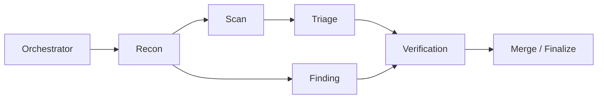

<div align="center">

# AutoCVE - 一键挖掘 CVE，筛项目、审源码、验漏洞、出报告，全流程自动化


[](https://www.gnu.org/licenses/agpl-3.0)
[](https://www.python.org/)
[](https://fastapi.tiangolo.com/)
[](https://react.dev/)
[](https://www.postgresql.org/)

<br>

<p align="center">
  
</p>

[📚 项目文档](#-项目文档) ·
[✨ 核心能力](#-核心能力) ·
[🚀 快速开始](#-快速开始) ·
[🏆 CVE 成果](#-cve-挖掘成果)

<p>
  <strong>简体中文</strong> | <a href="./README_EN.md">English</a>
</p>

</div>

---

## 📚 项目文档

### 📖 [用户使用手册](./docs/USER_GUIDE.md)

涵盖环境部署、模型配置、项目导入、Agent 审计、一键 CVE、漏洞管理和 Skills 管理完整使用说明，并提供各功能界面预览。

### 🏗️ [架构设计文档](./docs/ARCHITECTURE_DESIGN.md)

介绍 AutoCVE 的整体架构、Agent 工作流、工具编排、权限保护、Agent Runtime 以及 ReAct Loop 状态机设计。

### 🔌 [接口文档](./docs/API_DOCUMENTATION.md)

提供后端 API、数据结构、请求参数及接口调试说明。

---

## ✨ 核心能力

### 🚀 一键完成 CVE 挖掘

实现从项目筛选、仓库导入、审计任务创建、Agent 漏洞挖掘到 CVE 申报报告生成的全流程自动化。用户仅需复制报告内容并提交，即可完成后续 CVE 申请。

### 🤖 Multi-Agent 协同审计

通过 Orchestrator 统一调度 Recon、Scan、Triage、Finding 和 Verification 等 Agent，协同完成信息收集、工具扫描、误报过滤、漏洞深挖与动态验证。



### 🧩 三种审计模式

根据不同审计目标灵活选择增强扫描、智能审计或综合审计，兼顾扫描效率、挖掘深度与审计覆盖范围。

|     审计模式    |         核心 Agent        | 适用场景                        |
| :---------: | :---------------------: | :-------------------------- |
|  ⚡ **增强扫描** |      Scan → Triage      | 快速分析工具扫描结果并过滤误报             |
| 🧠 **智能审计** |         Finding         | 深度挖掘高价值漏洞，适用于 CVE 和 0Day 研究 |
| 🔍 **综合审计** | Scan → Triage + Finding | 融合工具扫描与源码分析，开展全量审计          |

### 🎯 面向 CVE 挖掘的专用 Agent

Finding Agent 是 AutoCVE 的核心审计能力，专为 CVE 挖掘场景设计。它可直接分析项目源码，并结合 ReAct Loop、专项工具调用、Nudge 纠偏及 `FinalizeFinding` 结构化终止机制，最终产出符合 CVE 申报条件的高价值漏洞。

<details>
<summary><strong>💬 交互式审计与全过程追踪</strong></summary>

<br>

* **支持用户交互**：将完整审计过程作为会话上下文，用户可围绕审计结果继续追问，让 Agent 补充证据、解释攻击链、完善复现步骤或扩展漏洞分析。
* **可视化审计追踪**：集中展示活动日志、Agent Tree、工具调用、阶段进度、初步报告和审计会话，方便复盘每次审计的执行路径与关键过程。

</details>

<details>
<summary><strong>🗂️ 智能漏洞管理与 Skills 扩展</strong></summary>

<br>

* **智能化漏洞管理**：审计发现的漏洞由 Agent 调用工具自动提交，经过去重后以结构化形式入库，并在漏洞管理模块中统一维护。
* **专属 Skills 配置**：支持根据实际需求为不同 Agent 配置专属 Skills，灵活扩展各 Agent 的能力边界。

</details>

---

## 🚀 快速开始

### ⚡ 一行命令部署

无需克隆仓库，一行命令即可启动：

Linux / macOS / Git Bash :

```bash
curl -fsSL https://raw.githubusercontent.com/larlarua/AutoCVE/v1.0.5/docker-compose.prod.yml \
  | docker compose -f - up -d
```
Windows PowerShell / CMD :
```bash
curl.exe -fsSL https://raw.githubusercontent.com/larlarua/AutoCVE/v1.0.5/docker-compose.prod.yml | docker compose -f - up -d
```

### 🛠️ 源码部署

适用于本地开发、功能调试或二次开发：

```bash
git clone https://github.com/larlarua/AutoCVE.git
cd AutoCVE
docker compose up -d --build
```

### 🌐 服务访问

服务启动完成后，可通过以下地址访问：

| 服务          | 访问地址                       | 用途           |
| :---------- | :------------------------- | :----------- |
| 🖥️ 前端      | http://localhost:3000      | AutoCVE 用户界面 |
| ⚙️ 后端 API   | http://localhost:8000      | 后端接口服务       |
| 📘 Swagger  | http://localhost:8000/docs | API 文档与接口调试  |
| 🗄️ Adminer | http://localhost:8080      | 数据库管理        |

> [!TIP]
> **快速体验完整审计流程**
>
> 配置模型 → 导入项目 → 创建审计任务 → 跟踪实时审计 → 管理漏洞 → 编辑或导出报告

---

## 🏆 CVE 挖掘成果

<p align="left">
  
  
  
  
</p>

> [!NOTE]
> AutoCVE 在为期一周的测试中，共发现并提交了 **30 个安全漏洞**，覆盖 **14 个开源项目**。
>
> 点击表格中的 CVE 编号可查看官方记录，完整漏洞报告收录于
> **[larlarua/vulnerability-reports](https://github.com/larlarua/vulnerability-reports/)**。

<details open>
<summary><strong>🔍 查看 CVE 成果明细（30）</strong></summary>

<br>

| CVE 编号 | 项目 | 项目热度 | 漏洞类型 | CVSS | 漏洞内容 |
|:---:|:---:|:---:|:---:|:----:|:----:|
| [CVE-2026-40904](https://www.cve.org/CVERecord?id=CVE-2026-40904) |  Chartbrew  |      | Improper Access Control | **8.1** | [查看详情](https://github.com/larlarua/vulnerability-reports/blob/main/CVE-2026-40904/detail_en.md) |
| [CVE-2026-40603](https://www.cve.org/CVERecord?id=CVE-2026-40603) |  Chartbrew  |      | Improper Access Control | **6.5** | [查看详情](https://github.com/larlarua/vulnerability-reports/blob/main/CVE-2026-40603/detail_en.md) |
| [CVE-2026-40601](https://www.cve.org/CVERecord?id=CVE-2026-40601) |  Chartbrew  |      | Missing Authorization   | **7.5** | [查看详情](https://github.com/larlarua/vulnerability-reports/blob/main/CVE-2026-40601/detail_en.md) |
| [CVE-2026-40600](https://www.cve.org/CVERecord?id=CVE-2026-40600) |  Chartbrew  |      | Improper Access Control | **8.1** | [查看详情](https://github.com/larlarua/vulnerability-reports/blob/main/CVE-2026-40600/detail_en.md) |
| [CVE-2026-40595](https://www.cve.org/CVERecord?id=CVE-2026-40595) |  Chartbrew  |      | Improper Access Control | **7.5** | [查看详情](https://github.com/larlarua/vulnerability-reports/blob/main/CVE-2026-40595/detail_en.md) |
| [CVE-2026-42181](https://www.cve.org/CVERecord?id=CVE-2026-42181) |    Lemmy    |           | SSRF                    | **6.5** | [查看详情](https://github.com/larlarua/vulnerability-reports/blob/main/CVE-2026-42181/detail_en.md) |
| [CVE-2026-42180](https://www.cve.org/CVERecord?id=CVE-2026-42180) |    Lemmy    |           | SSRF                    | **6.3** | [查看详情](https://github.com/larlarua/vulnerability-reports/blob/main/CVE-2026-42180/detail_en.md) |
|  [CVE-2026-7290](https://www.cve.org/CVERecord?id=CVE-2026-7290)  |  JeecgBoot  |      | SQL Injection           | **6.3** |  [查看详情](https://github.com/larlarua/vulnerability-reports/blob/main/CVE-2026-7290/detail_en.md) |
|  [CVE-2026-7291](https://www.cve.org/CVERecord?id=CVE-2026-7291)  |     o2oa    |                | SSRF                    | **6.3** |  [查看详情](https://github.com/larlarua/vulnerability-reports/blob/main/CVE-2026-7291/detail_en.md) |
|  [CVE-2026-7292](https://www.cve.org/CVERecord?id=CVE-2026-7292)  |     o2oa    |                | RCE                     | **5.6** |  [查看详情](https://github.com/larlarua/vulnerability-reports/blob/main/CVE-2026-7292/detail_en.md) |
|  [CVE-2026-7303](https://www.cve.org/CVERecord?id=CVE-2026-7303)  |   xxl-job   |          | Improper Access Control | **3.7** |   [查看详情](https://github.com/larlarua/vulnerability-reports/blob/main/CVE-2026-7303/detail.md)   |
|  [CVE-2026-7305](https://www.cve.org/CVERecord?id=CVE-2026-7305)  |   xxl-job   |          | SSRF                    | **6.3** |   [查看详情](https://github.com/larlarua/vulnerability-reports/blob/main/CVE-2026-7305/detail.md)   |
|  [CVE-2026-7306](https://www.cve.org/CVERecord?id=CVE-2026-7306)  |   xxl-job   |          | Hard-coded Key          | **5.6** |   [查看详情](https://github.com/larlarua/vulnerability-reports/blob/main/CVE-2026-7306/detail.md)   |
| [CVE-2026-40610](https://www.cve.org/CVERecord?id=CVE-2026-40610) |   BentoML   |          | Link Following          | **5.5** | [查看详情](https://github.com/larlarua/vulnerability-reports/blob/main/CVE-2026-40610/detail_en.md) |
| [CVE-2026-48763](https://www.cve.org/CVERecord?id=CVE-2026-48763) |  typebot.io |  | Missing Authorization   | **8.2** | [查看详情](https://github.com/larlarua/vulnerability-reports/blob/main/CVE-2026-48763/detail_en.md) |
| [CVE-2026-48764](https://www.cve.org/CVERecord?id=CVE-2026-48764) |  typebot.io |  | SSRF                    | **8.2** | [查看详情](https://github.com/larlarua/vulnerability-reports/blob/main/CVE-2026-48764/detail_en.md) |
| [CVE-2026-48765](https://www.cve.org/CVERecord?id=CVE-2026-48765) |  typebot.io |  | Authorization Bypass    | **9.9** | [查看详情](https://github.com/larlarua/vulnerability-reports/blob/main/CVE-2026-48765/detail_en.md) |
| [CVE-2026-48766](https://www.cve.org/CVERecord?id=CVE-2026-48766) |  typebot.io |  | Sensitive Data Exposure | **7.6** | [查看详情](https://github.com/larlarua/vulnerability-reports/blob/main/CVE-2026-48766/detail_en.md) |
| [CVE-2026-48767](https://www.cve.org/CVERecord?id=CVE-2026-48767) |  typebot.io |  | Sensitive Data Exposure | **7.6** | [查看详情](https://github.com/larlarua/vulnerability-reports/blob/main/CVE-2026-48767/detail_en.md) |
| [CVE-2026-45296](https://www.cve.org/CVERecord?id=CVE-2026-45296) |  OpenReplay |    | Improper Access Control | **7.7** | [查看详情](https://github.com/larlarua/vulnerability-reports/blob/main/CVE-2026-45296/detail_en.md) |
| [CVE-2026-46372](https://www.cve.org/CVERecord?id=CVE-2026-46372) | SillyTavern |  | SSRF                    | **8.5** | [查看详情](https://github.com/larlarua/vulnerability-reports/blob/main/CVE-2026-46372/detail_en.md) |
| [CVE-2026-45260](https://www.cve.org/CVERecord?id=CVE-2026-45260) |   pimcore   |          | Missing Authorization   | **8.1** | [查看详情](https://github.com/larlarua/vulnerability-reports/blob/main/CVE-2026-45260/detail_en.md) |
| [CVE-2026-41235](https://www.cve.org/CVERecord?id=CVE-2026-41235) |   froxlor   |          | Incorrect Authorization | **8.8** | [查看详情](https://github.com/larlarua/vulnerability-reports/blob/main/CVE-2026-41235/detail_en.md) |
| [CVE-2026-41236](https://www.cve.org/CVERecord?id=CVE-2026-41236) |   froxlor   |          | Link Following          | **8.8** | [查看详情](https://github.com/larlarua/vulnerability-reports/blob/main/CVE-2026-41236/detail_en.md) |
| [CVE-2026-43984](https://www.cve.org/CVERecord?id=CVE-2026-43984) |   Tautulli  |        | Stored XSS              | **8.9** | [查看详情](https://github.com/larlarua/vulnerability-reports/blob/main/CVE-2026-43984/detail_en.md) |
| [CVE-2026-43985](https://www.cve.org/CVERecord?id=CVE-2026-43985) |   Tautulli  |        | CSRF                    | **8.8** | [查看详情](https://github.com/larlarua/vulnerability-reports/blob/main/CVE-2026-43985/detail_en.md) |
| [CVE-2026-43986](https://www.cve.org/CVERecord?id=CVE-2026-43986) |   Tautulli  |        | SSRF                    | **9.9** | [查看详情](https://github.com/larlarua/vulnerability-reports/blob/main/CVE-2026-43986/detail_en.md) |
| [CVE-2026-54091](https://www.cve.org/CVERecord?id=CVE-2026-54091) | filebrowser |  | Incorrect Authorization | **7.5** | [查看详情](https://github.com/larlarua/vulnerability-reports/blob/main/CVE-2026-54091/detail_en.md) |
| [CVE-2026-50279](https://www.cve.org/CVERecord?id=CVE-2026-50279) |   craftcms  |             | Improper Authorization  | **6.5** | [查看详情](https://github.com/larlarua/vulnerability-reports/blob/main/CVE-2026-50279/detail_en.md) |
| [CVE-2026-50280](https://www.cve.org/CVERecord?id=CVE-2026-50280) |   craftcms  |             | Improper Access Control | **6.5** | [查看详情](https://github.com/larlarua/vulnerability-reports/blob/main/CVE-2026-50280/detail_en.md) |

</details>

---


## ⚠️ 安全与合规

> [!WARNING]
>
> 本项目仅限用于已获授权的安全研究、代码审计及学习交流，严禁将其用于任何未经授权的漏洞扫描、渗透测试或安全评估。
>
> 请确保仅在获得明确授权的目标与环境中执行扫描、漏洞验证或 PoC 测试。

> [!IMPORTANT]
>
> 提交漏洞时，请遵循目标项目的安全政策及漏洞披露规范，包括但不限于：
>
> * `SECURITY.md`
> * GitHub Private Vulnerability Reporting
> * CNA 提交流程
> * 其他负责任的漏洞披露机制

---

## 💬 交流与反馈

> [!TIP]
>
>AutoCVE 的设计初衷，是探索 Agent 在自动化 CVE 挖掘场景中的应用与实践。目前，项目仍在持续迭代和完善，架构设计和功能实现都有不少需要打磨的地方。欢迎大家提交 Issue、PR，分享使用反馈或功能建议，共同提升 AutoCVE 的可靠性与实用性。
>
>也欢迎随时来找我交流探讨！无论是技术问题、功能建议，还是 CVE 挖掘过程中遇到的疑问，都可以通过以下方式联系我：
>
> * 📧 **Email：** [359111529@qq.com](mailto:359111529@qq.com)
> * 🐙 **GitHub：** [@larlarua](https://github.com/larlarua)

---

## 🙏 致谢

> [!NOTE]
>
> AutoCVE 项目在开发初期参考并学习了 [DeepAudit](https://github.com/lintsinghua/DeepAudit) 的工程架构，这为本项目的快速起步提供了重要帮助。
>
> 谨此向 DeepAudit 项目及其开发者致以诚挚的谢意。

<details>
<summary><strong>🧩 关于 AutoCVE 的工程设计</strong></summary>

<br>

在参考相关开源项目工程经验的基础上，AutoCVE 针对自动化 CVE 挖掘这一场景，对项目整体 Agent 工程进行了重构与定制化设计，重点实现了审计流程编排、ReAct Loop 工程化重构、状态机调度、循环控制与终止判断、工具编排、报告生成、Skill 机制以及对话交互等能力。

后续，AutoCVE 也将持续迭代优化，进一步提升在漏洞挖掘场景下的自动化水平、审计深度与实战效果。

</details>

---

## License

本项目基于 [AGPL-3.0](./LICENSE) 发布。
