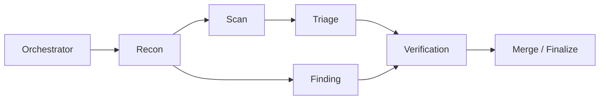

<div align="center">

# AutoCVE - One-Click CVE Discovery: Select Projects, Audit Source Code, Verify Vulnerabilities, Generate Reports, Fully Automated


[](https://www.gnu.org/licenses/agpl-3.0)
[](https://www.python.org/)
[](https://fastapi.tiangolo.com/)
[](https://react.dev/)
[](https://www.postgresql.org/)

<br>

<p align="center">
  
</p>

[📚 Project Documentation](#-project-documentation) ·
[✨ Core Capabilities](#-core-capabilities) ·
[🚀 Quick Start](#-quick-start) ·
[🏆 CVE Results](#-cve-discovery-results)

<p>
  <a href="./README.md">简体中文</a> | <strong>English</strong>
</p>

</div>

---

## 📚 Project Documentation

### 📖 [User Guide](./docs/USER_GUIDE_EN.md)

Covers complete usage instructions for environment deployment, model configuration, project import, Agent auditing, one-click CVE, vulnerability management, and Skills management, and provides previews of each feature interface.

### 🏗️ [Architecture Design Document](./docs/ARCHITECTURE_DESIGN_EN.md)

Introduces AutoCVE's overall architecture, Agent workflow, tool orchestration, permission protection, Agent Runtime, and ReAct Loop state-machine design.

### 🔌 [API Documentation](./docs/API_DOCUMENTATION_EN.md)

Provides backend API, data structure, request parameter, and API debugging instructions.

---

## ✨ Core Capabilities

### 🚀 Complete CVE Discovery in One Click

Automates the full workflow from project selection, repository import, audit task creation, and Agent vulnerability discovery to CVE submission report generation. Users only need to copy the report content and submit it to complete the subsequent CVE application.

### 🤖 Multi-Agent Collaborative Auditing

The Orchestrator centrally schedules Agents such as Recon, Scan, Triage, Finding, and Verification to collaboratively complete information collection, tool scanning, false-positive filtering, deep vulnerability discovery, and dynamic verification.



### 🧩 Three Audit Modes

Choose enhanced scanning, intelligent auditing, or comprehensive auditing flexibly according to different audit goals, balancing scanning efficiency, discovery depth, and audit coverage.

|     Audit Mode    |         Core Agent        | Applicable Scenario                        |
| :---------: | :---------------------: | :-------------------------- |
|  ⚡ **Enhanced Scan** |      Scan → Triage      | Quickly analyze tool scan results and filter false positives             |
| 🧠 **Intelligent Audit** |         Finding         | Deeply discover high-value vulnerabilities; suitable for CVE and 0Day research |
| 🔍 **Comprehensive Audit** | Scan → Triage + Finding | Combine tool scanning with source-code analysis for full-scale auditing          |

### 🎯 Dedicated Agent for CVE Discovery

Finding Agent is AutoCVE's core audit capability and is designed specifically for CVE discovery scenarios. It can directly analyze project source code and, together with the ReAct Loop, specialized tool calls, Nudge correction, and the structured `FinalizeFinding` termination mechanism, ultimately produce high-value vulnerabilities that meet CVE submission requirements.

<details>
<summary><strong>💬 Interactive Auditing and End-to-End Tracing</strong></summary>

<br>

* **User interaction support**: Treats the complete audit process as conversation context, allowing users to keep asking follow-up questions around audit results and let the Agent supplement evidence, explain attack chains, improve reproduction steps, or expand vulnerability analysis.
* **Visual audit tracing**: Centrally displays activity logs, Agent Tree, tool calls, phase progress, preliminary reports, and audit sessions, making it easier to review the execution path and key process of each audit.

</details>

<details>
<summary><strong>🗂️ Intelligent Vulnerability Management and Skills Extension</strong></summary>

<br>

* **Intelligent vulnerability management**: Vulnerabilities discovered during audits are automatically submitted by Agent tool calls, deduplicated, stored in structured form, and centrally maintained in the vulnerability management module.
* **Dedicated Skills configuration**: Supports configuring dedicated Skills for different Agents according to actual needs, flexibly extending the capability boundaries of each Agent.

</details>

---

## 🚀 Quick Start

### ⚡ One-Line Deployment Command

No need to clone the repository. Start it with one command:

```bash
curl -fsSL https://raw.githubusercontent.com/larlarua/AutoCVE/v1.0.0/docker-compose.prod.yml \
  | docker compose -f - up -d
```

### 🛠️ Source Deployment

Suitable for local development, feature debugging, or secondary development:

```bash
git clone https://github.com/larlarua/AutoCVE.git
cd AutoCVE
docker compose up -d --build
```

### 🌐 Service Access

After the services start, access them through the following addresses:

| Service          | Access URL                       | Purpose           |
| :---------- | :------------------------- | :----------- |
| 🖥️ Frontend      | http://localhost:3000      | AutoCVE user interface |
| ⚙️ Backend API   | http://localhost:8000      | Backend API service       |
| 📘 Swagger  | http://localhost:8000/docs | API documentation and debugging  |
| 🗄️ Adminer | http://localhost:8080      | Database management        |

> [!TIP]
> **Quickly Experience the Complete Audit Workflow**
>
> Configure model → Import project → Create audit task → Track real-time audit → Manage vulnerabilities → Edit or export report

---

## 🏆 CVE Discovery Results

<p align="left">
  
  
  
  
</p>

> [!NOTE]
> During one week of testing, AutoCVE discovered and submitted **30 security vulnerabilities**, covering **14 open-source projects**.
>
> Click the CVE identifiers in the table to view official records. Complete vulnerability reports are collected in
> **[larlarua/vulnerability-reports](https://github.com/larlarua/vulnerability-reports/)**.

<details open>
<summary><strong>🔍 View CVE Result Details (30)</strong></summary>

<br>

| CVE ID | Project | Project Popularity | Vulnerability Type | CVSS | Vulnerability Details |
|:---:|:---:|:---:|:---:|:----:|:----:|
| [CVE-2026-40904](https://www.cve.org/CVERecord?id=CVE-2026-40904) |  Chartbrew  |      | Improper Access Control | **8.1** | [View Details](https://github.com/larlarua/vulnerability-reports/blob/main/CVE-2026-40904/detail_en.md) |
| [CVE-2026-40603](https://www.cve.org/CVERecord?id=CVE-2026-40603) |  Chartbrew  |      | Improper Access Control | **6.5** | [View Details](https://github.com/larlarua/vulnerability-reports/blob/main/CVE-2026-40603/detail_en.md) |
| [CVE-2026-40601](https://www.cve.org/CVERecord?id=CVE-2026-40601) |  Chartbrew  |      | Missing Authorization   | **7.5** | [View Details](https://github.com/larlarua/vulnerability-reports/blob/main/CVE-2026-40601/detail_en.md) |
| [CVE-2026-40600](https://www.cve.org/CVERecord?id=CVE-2026-40600) |  Chartbrew  |      | Improper Access Control | **8.1** | [View Details](https://github.com/larlarua/vulnerability-reports/blob/main/CVE-2026-40600/detail_en.md) |
| [CVE-2026-40595](https://www.cve.org/CVERecord?id=CVE-2026-40595) |  Chartbrew  |      | Improper Access Control | **7.5** | [View Details](https://github.com/larlarua/vulnerability-reports/blob/main/CVE-2026-40595/detail_en.md) |
| [CVE-2026-42181](https://www.cve.org/CVERecord?id=CVE-2026-42181) |    Lemmy    |           | SSRF                    | **6.5** | [View Details](https://github.com/larlarua/vulnerability-reports/blob/main/CVE-2026-42181/detail_en.md) |
| [CVE-2026-42180](https://www.cve.org/CVERecord?id=CVE-2026-42180) |    Lemmy    |           | SSRF                    | **6.3** | [View Details](https://github.com/larlarua/vulnerability-reports/blob/main/CVE-2026-42180/detail_en.md) |
|  [CVE-2026-7290](https://www.cve.org/CVERecord?id=CVE-2026-7290)  |  JeecgBoot  |      | SQL Injection           | **6.3** |  [View Details](https://github.com/larlarua/vulnerability-reports/blob/main/CVE-2026-7290/detail_en.md) |
|  [CVE-2026-7291](https://www.cve.org/CVERecord?id=CVE-2026-7291)  |     o2oa    |                | SSRF                    | **6.3** |  [View Details](https://github.com/larlarua/vulnerability-reports/blob/main/CVE-2026-7291/detail_en.md) |
|  [CVE-2026-7292](https://www.cve.org/CVERecord?id=CVE-2026-7292)  |     o2oa    |                | RCE                     | **5.6** |  [View Details](https://github.com/larlarua/vulnerability-reports/blob/main/CVE-2026-7292/detail_en.md) |
|  [CVE-2026-7303](https://www.cve.org/CVERecord?id=CVE-2026-7303)  |   xxl-job   |          | Improper Access Control | **3.7** |   [View Details](https://github.com/larlarua/vulnerability-reports/blob/main/CVE-2026-7303/detail.md)   |
|  [CVE-2026-7305](https://www.cve.org/CVERecord?id=CVE-2026-7305)  |   xxl-job   |          | SSRF                    | **6.3** |   [View Details](https://github.com/larlarua/vulnerability-reports/blob/main/CVE-2026-7305/detail.md)   |
|  [CVE-2026-7306](https://www.cve.org/CVERecord?id=CVE-2026-7306)  |   xxl-job   |          | Hard-coded Key          | **5.6** |   [View Details](https://github.com/larlarua/vulnerability-reports/blob/main/CVE-2026-7306/detail.md)   |
| [CVE-2026-40610](https://www.cve.org/CVERecord?id=CVE-2026-40610) |   BentoML   |          | Link Following          | **5.5** | [View Details](https://github.com/larlarua/vulnerability-reports/blob/main/CVE-2026-40610/detail_en.md) |
| [CVE-2026-48763](https://www.cve.org/CVERecord?id=CVE-2026-48763) |  typebot.io |  | Missing Authorization   | **8.2** | [View Details](https://github.com/larlarua/vulnerability-reports/blob/main/CVE-2026-48763/detail_en.md) |
| [CVE-2026-48764](https://www.cve.org/CVERecord?id=CVE-2026-48764) |  typebot.io |  | SSRF                    | **8.2** | [View Details](https://github.com/larlarua/vulnerability-reports/blob/main/CVE-2026-48764/detail_en.md) |
| [CVE-2026-48765](https://www.cve.org/CVERecord?id=CVE-2026-48765) |  typebot.io |  | Authorization Bypass    | **9.9** | [View Details](https://github.com/larlarua/vulnerability-reports/blob/main/CVE-2026-48765/detail_en.md) |
| [CVE-2026-48766](https://www.cve.org/CVERecord?id=CVE-2026-48766) |  typebot.io |  | Sensitive Data Exposure | **7.6** | [View Details](https://github.com/larlarua/vulnerability-reports/blob/main/CVE-2026-48766/detail_en.md) |
| [CVE-2026-48767](https://www.cve.org/CVERecord?id=CVE-2026-48767) |  typebot.io |  | Sensitive Data Exposure | **7.6** | [View Details](https://github.com/larlarua/vulnerability-reports/blob/main/CVE-2026-48767/detail_en.md) |
| [CVE-2026-45296](https://www.cve.org/CVERecord?id=CVE-2026-45296) |  OpenReplay |    | Improper Access Control | **7.7** | [View Details](https://github.com/larlarua/vulnerability-reports/blob/main/CVE-2026-45296/detail_en.md) |
| [CVE-2026-46372](https://www.cve.org/CVERecord?id=CVE-2026-46372) | SillyTavern |  | SSRF                    | **8.5** | [View Details](https://github.com/larlarua/vulnerability-reports/blob/main/CVE-2026-46372/detail_en.md) |
| [CVE-2026-45260](https://www.cve.org/CVERecord?id=CVE-2026-45260) |   pimcore   |          | Missing Authorization   | **8.1** | [View Details](https://github.com/larlarua/vulnerability-reports/blob/main/CVE-2026-45260/detail_en.md) |
| [CVE-2026-41235](https://www.cve.org/CVERecord?id=CVE-2026-41235) |   froxlor   |          | Incorrect Authorization | **8.8** | [View Details](https://github.com/larlarua/vulnerability-reports/blob/main/CVE-2026-41235/detail_en.md) |
| [CVE-2026-41236](https://www.cve.org/CVERecord?id=CVE-2026-41236) |   froxlor   |          | Link Following          | **8.8** | [View Details](https://github.com/larlarua/vulnerability-reports/blob/main/CVE-2026-41236/detail_en.md) |
| [CVE-2026-43984](https://www.cve.org/CVERecord?id=CVE-2026-43984) |   Tautulli  |        | Stored XSS              | **8.9** | [View Details](https://github.com/larlarua/vulnerability-reports/blob/main/CVE-2026-43984/detail_en.md) |
| [CVE-2026-43985](https://www.cve.org/CVERecord?id=CVE-2026-43985) |   Tautulli  |        | CSRF                    | **8.8** | [View Details](https://github.com/larlarua/vulnerability-reports/blob/main/CVE-2026-43985/detail_en.md) |
| [CVE-2026-43986](https://www.cve.org/CVERecord?id=CVE-2026-43986) |   Tautulli  |        | SSRF                    | **9.9** | [View Details](https://github.com/larlarua/vulnerability-reports/blob/main/CVE-2026-43986/detail_en.md) |
| [CVE-2026-54091](https://www.cve.org/CVERecord?id=CVE-2026-54091) | filebrowser |  | Incorrect Authorization | **7.5** | [View Details](https://github.com/larlarua/vulnerability-reports/blob/main/CVE-2026-54091/detail_en.md) |
| [CVE-2026-50279](https://www.cve.org/CVERecord?id=CVE-2026-50279) |   craftcms  |             | Improper Authorization  | **6.5** | [View Details](https://github.com/larlarua/vulnerability-reports/blob/main/CVE-2026-50279/detail_en.md) |
| [CVE-2026-50280](https://www.cve.org/CVERecord?id=CVE-2026-50280) |   craftcms  |             | Improper Access Control | **6.5** | [View Details](https://github.com/larlarua/vulnerability-reports/blob/main/CVE-2026-50280/detail_en.md) |

</details>

---


## ⚠️ Security and Compliance

> [!WARNING]
>
> This project is only for authorized security research, code auditing, and learning or communication. It is strictly prohibited to use it for any unauthorized vulnerability scanning, penetration testing, or security assessment.
>
> Ensure that scanning, vulnerability verification, or PoC testing is performed only against targets and environments with explicit authorization.

> [!IMPORTANT]
>
> When submitting vulnerabilities, follow the target project's security policy and vulnerability disclosure guidelines, including but not limited to:
>
> * `SECURITY.md`
> * GitHub Private Vulnerability Reporting
> * CNA submission process
> * Other responsible vulnerability disclosure mechanisms

---

## 💬 Communication and Feedback

> [!TIP]
>
> AutoCVE was originally designed to explore the application and practice of Agents in automated CVE discovery scenarios. At present, the project is still continuously iterating and improving, and both the architecture design and feature implementation have many areas that need refinement. Everyone is welcome to submit Issues and PRs, share usage feedback, or suggest features to jointly improve AutoCVE's reliability and practicality.
>
> You are also welcome to contact me anytime for discussion. Whether it is a technical question, feature suggestion, or doubt encountered during CVE discovery, you can reach me through the following methods:
>
> * 📧 **Email:** [359111529@qq.com](mailto:359111529@qq.com)
> * 🐙 **GitHub:** [@larlarua](https://github.com/larlarua)

---

## 🙏 Acknowledgements

> [!NOTE]
>
> In its early development stage, AutoCVE referenced and learned from the engineering architecture of [DeepAudit](https://github.com/lintsinghua/DeepAudit), which provided important support for the project’s rapid start.
>
> We would like to express our sincere gratitude to the DeepAudit project and its developers.

<details>
<summary><strong>🧩 About AutoCVE’s Engineering Design</strong></summary>

<br>

Building on engineering experience from relevant open-source projects, AutoCVE has been redesigned and customized for the automated CVE discovery scenario at the overall Agent engineering level. Key work includes audit workflow orchestration, ReAct Loop engineering reconstruction, state machine scheduling, loop control and termination judgment, tool orchestration, report generation, the Skill mechanism, and conversational interaction capabilities.

Going forward, AutoCVE will continue to iterate and improve, further enhancing its automation, audit depth, and practical effectiveness in vulnerability discovery scenarios.

</details>

---

## License

This project is released under [AGPL-3.0](./LICENSE).
