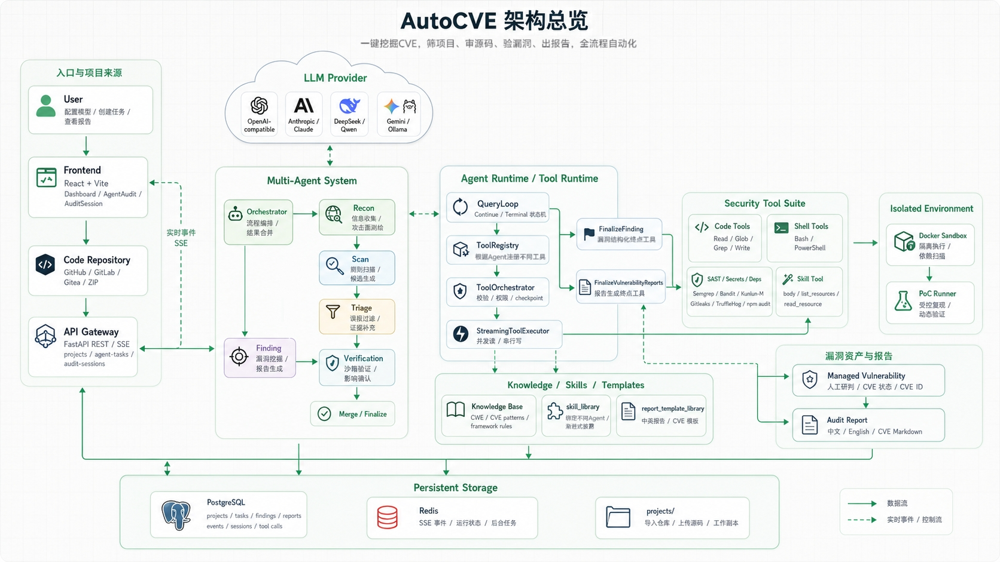
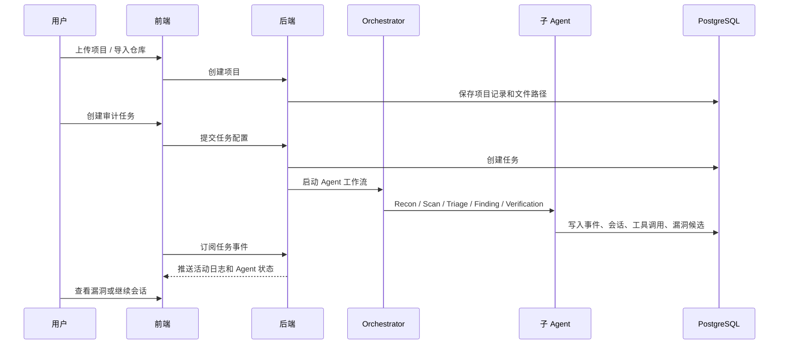
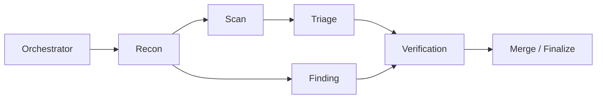
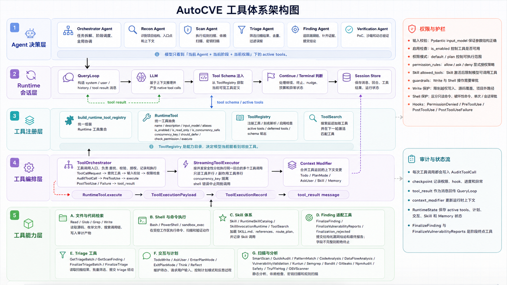
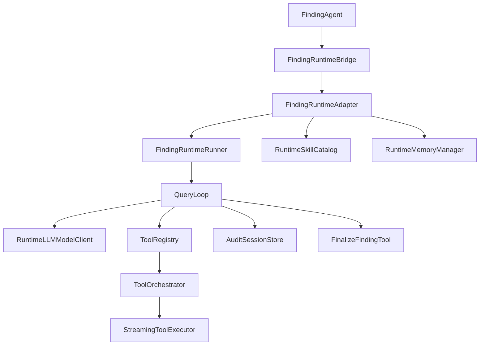
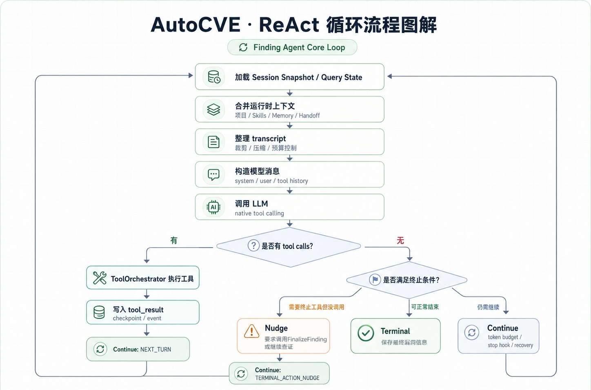

# AutoCVE 架构设计文档

> 本文用于说明 AutoCVE 的整体架构、前后端代码结构、Agent 工作流、Agent 协调机制以及 Finding Agent 的工程实现。  

## 目录

- [AutoCVE 架构设计文档](#autocve-架构设计文档)
  - [目录](#目录)
  - [1. 项目定位](#1-项目定位)
  - [2. 总体架构](#2-总体架构)
    - [2.1 前端职责](#21-前端职责)
    - [2.2 后端职责](#22-后端职责)
    - [2.3 存储与运行时组件](#23-存储与运行时组件)
  - [3. 代码目录](#3-代码目录)
    - [3.1 根目录](#31-根目录)
    - [3.2 前端目录](#32-前端目录)
    - [3.3 后端目录](#33-后端目录)
  - [4. 业务主流程](#4-业务主流程)
  - [5. Agent 工作流架构](#5-agent-工作流架构)
    - [5.1 Agent 类型](#51-agent-类型)
    - [5.2 工作流编排](#52-工作流编排)
    - [5.3 Agent 协调机制](#53-agent-协调机制)
    - [5.4 事件与活动日志](#54-事件与活动日志)
  - [6. 工具体系](#6-工具体系)
    - [6.1 工具集](#61-工具集)
    - [6.2 工具编排](#62-工具编排)
      - [6.2.1 ToolRegistry](#621-toolregistry)
      - [6.2.2 ToolOrchestrator](#622-toolorchestrator)
      - [6.2.3 StreamingToolExecutor](#623-streamingtoolexecutor)
    - [6.2.4 上下文修改合并](#624-上下文修改合并)
    - [6.3 工具权限与保护](#63-工具权限与保护)
  - [7. Finding Agent 架构](#7-finding-agent-架构)
    - [7.1 Finding Runtime 组件](#71-finding-runtime-组件)
    - [7.2 ReAct 循环](#72-react-循环)
    - [7.3 Continue 节点条件](#73-continue-节点条件)
    - [7.4 Terminal 节点条件](#74-terminal-节点条件)
    - [7.5 FinalizeFinding 终止工具](#75-finalizefinding-终止工具)
  - [8. Nudge 触发机制](#8-nudge-触发机制)
    - [8.1 Native Tool Calling Reminder](#81-native-tool-calling-reminder)
    - [8.2 文本伪工具语法 Nudge](#82-文本伪工具语法-nudge)
    - [8.3 Terminal Action Nudge](#83-terminal-action-nudge)
    - [8.4 Continue Intent Nudge](#84-continue-intent-nudge)
    - [8.5 Token Budget Continuation](#85-token-budget-continuation)
    - [8.6 Stop Hook Blocking](#86-stop-hook-blocking)
    - [8.7 Finalizer Recovery](#87-finalizer-recovery)
  - [9. Skill 机制](#9-skill-机制)
    - [9.1 渐进式披露](#91-渐进式披露)
    - [9.2 Skill 加载流程](#92-skill-加载流程)
    - [9.3 Skill 工具](#93-skill-工具)
    - [9.4 显式 Skill 调用](#94-显式-skill-调用)


## 1. 项目定位

AutoCVE 是一个面向代码安全审计和 CVE 挖掘的 Agent 化审计平台。系统围绕“项目上传/导入 -> 自动化审计任务 -> Agent 工作流分析 -> 结构化漏洞结果输出 -> 一键CVE提交”的流程设计，同时保留用户对话、活动日志、Skills管理、模型方案配置等功能，方便用户在自动化审计基础上继续追问、补证和扩展分析。

## 2. 总体架构

系统由前端、后端、数据库、Redis、沙箱、项目文件区、Skills 库和报告模板库组成。



### 2.1 前端职责

前端负责提供产品化操作界面，包括：

- 仪表盘：项目整体概览
- 项目管理：项目上传、项目列表、项目详情
- 审计任务：创建任务、查看执行过程、查看活动日志
- Agent 审计页面：展示 Agent 执行状态、工具调用、思考过程、阶段进度和结果
- 审计会话：以审计全过程作为上下文，支持用户围绕某次审计继续与Agent进行对话，追加问题、补充验证思路或让 Agent 扩展分析
- 漏洞管理：查看、筛选、确认、跟进漏洞结果
- 一键 CVE：围绕 CVE 挖掘这一核心目标，自动化从Github上筛选项目并持续创建审计任务，直到Agent发现指定数量的CVE候选漏洞
- Skills 管理：Skills导入和管理，支持为不同Agent配置不同Skill
- 系统设置：为不同Agent配置不同的模型方案、开关工作流各Agent节点

### 2.2 后端职责

后端是整个平台的执行中枢，负责把前端发起的项目、任务、模型方案和 Agent 配置转换成一次可追踪的审计流程。它不仅保存业务数据，也负责调度 Agent、管理工具调用、记录审计过程，并把最终漏洞结果沉淀为结构化资产。

- 业务控制面：处理用户登录状态、项目上传与导入、审计任务创建、模型方案配置、工作流开关、漏洞结果管理、报告模板和 Skills 管理等产品功能。
- 审计工作流：根据任务配置启动 Orchestrator，由 Orchestrator 按固定流程调度 Recon、Scan、Triage、Finding、Verification 等 Agent 节点，保证审计阶段可预测、可回放。
- Agent Runtime：为 Finding、Triage 等节点提供会话式运行环境，负责模型调用、上下文组装、ReAct 循环、Continue/Terminal 状态转换、nudge 触发和最终结果校验。
- 工具执行层：统一管理 Read、Glob、Grep、Bash、PowerShell、Skill、FinalizeFinding 等工具的注册、输入校验、权限判断、并发编排和执行记录。
- 审计过程沉淀：持续保存 Agent 消息、工具调用、handoff、checkpoint、memory、trace 和活动日志，使前端可以展示实时过程，也方便用户后续基于同一次审计继续对话。
- 安全执行边界：将扫描、验证、代码运行、PoC 试验等高风险动作放入 sandbox 或受控工具链中执行，避免 Agent 直接在宿主环境中进行不可控操作。

### 2.3 存储与运行时组件

- PostgreSQL：保存用户、项目、任务、漏洞、Agent 事件、Audit Session、工具调用、运行状态等业务数据
- Redis：用于运行时缓存、异步任务状态或短期状态协调
- `projects/`：保存上传或导入的待审计项目
- `skill_library/`：保存 Skills，供 Agent 在审计过程中按需加载
- `report_template_library/`：保存报告模板
- `docker/sandbox/`：定义沙箱镜像和隔离运行环境

## 3. 代码目录

### 3.1 根目录

```text
.
├── backend/                    # FastAPI 后端、业务服务、Agent Runtime
├── frontend/                   # React + Vite 前端
├── docker/                     # Docker 相关文件，包含 sandbox 镜像
├── docs/                       # 使用手册、架构文档等项目文档
├── projects/                   # 项目上传/导入后的本地工作区
├── skill_library/              # Skills 库
├── report_template_library/    # 报告模板库
├── rules/                      # 规则或审计相关材料
├── scripts/                    # 辅助脚本
├── supabase/                   # Supabase/数据库相关材料
├── docker-compose.yml          # 默认一键部署编排
├── docker-compose.prod.yml     # 生产部署编排
└── README.md
```

### 3.2 前端目录

前端入口在 `frontend/src`。

```text
frontend/src
├── app/
│   ├── App.tsx                 # 应用根组件
│   ├── main.tsx                # 前端入口
│   ├── routes.tsx              # 路由配置
│   └── ProtectedRoute.tsx      # 登录保护路由
├── pages/
│   ├── Dashboard.tsx           # 仪表盘
│   ├── Projects.tsx            # 项目列表
│   ├── ProjectDetail.tsx       # 项目详情
│   ├── AuditTasks.tsx          # 审计任务列表
│   ├── TaskDetail.tsx          # 任务详情
│   ├── AgentAudit/             # Agent 审计执行页
│   ├── AuditSession/           # 审计会话页
│   ├── OneClickCVE.tsx         # 一键 CVE
│   ├── SkillsManager.tsx       # Skills 管理
│   ├── VulnerabilityManagement.tsx
│   ├── ReportTemplatesPage.tsx
│   ├── AdminDashboard.tsx
│   └── Account.tsx
├── components/
│   ├── agent/                  # Agent 状态、树、执行面板等组件
│   ├── audit/                  # 审计相关组件
│   ├── dashboard/              # 仪表盘组件
│   ├── layout/                 # 布局与导航
│   ├── report/                 # 报告相关组件
│   ├── system/                 # 系统设置组件
│   ├── ui/                     # 通用 UI 组件
│   └── vulnerability/          # 漏洞展示与管理组件
├── features/
│   ├── project/                # 项目相关业务封装
│   ├── reports/                # 报告业务封装
│   └── analysis/               # 分析/扫描能力相关封装
└── shared/
    ├── api/                    # 请求封装
    ├── config/                 # 前端配置
    ├── constants/              # 常量
    ├── context/                # 全局上下文
    ├── hooks/                  # 通用 Hooks
    ├── services/               # 前端服务层
    ├── types/                  # 类型定义
    └── utils/                  # 工具函数
```

前端路由的主线是“项目 -> 任务 -> Agent 审计 -> 漏洞结果/审计会话”。其中：

- `/projects` 和 `/projects/:id` 承载项目管理
- `/audit-tasks` 和 `/tasks/:id` 承载任务管理
- `/agent-audit/:taskId` 展示 Agent 执行中的实时过程
- `/audit-sessions/:sessionId` 支持审计会话继续对话
- `/one-click-cve` 面向 CVE 挖掘场景提供快速入口
- `/vulnerabilities` 汇总漏洞结果
- `/skills` 管理 Skills

### 3.3 后端目录

后端入口在 `backend/app`。

```text
backend/app
├── main.py                     # FastAPI 应用入口
├── api/
│   └── v1/endpoints/           # 业务路由入口
├── core/                       # 配置、安全、日志等核心能力
├── db/                         # 数据库会话和初始化
├── models/                     # SQLAlchemy 模型
├── schemas/                    # Pydantic Schema
├── services/
│   ├── agent/                  # Agent 定义、编排器、阶段工具
│   ├── finding_runtime/        # Finding Agent 新 runtime
│   ├── runtime_core/           # Runtime 通用工具、权限、hook、session 状态
│   ├── agent_runtime/          # 通用 runtime bridge/spec，当前用于 Triage runtime
│   ├── scan_runtime/           # 扫描流水线
│   ├── triage_runtime/         # 扫描结果复核 runtime
│   ├── one_click_cve/          # 一键 CVE 相关能力
│   ├── llm/                    # LLM Provider 适配
│   ├── rag/                    # 检索增强相关能力
│   └── ...                     # 项目、漏洞、报告、配置等服务
└── utils/                      # 通用工具函数
```

Agent 相关代码主要分为三层：

- `services/agent/`：包含 Orchestrator、Recon、Scan、Triage、Finding、Verification 各 Agent 定义。
- `services/finding_runtime/`：包含 QueryLoop、Runner、Bridge、SessionStore、Memory、Skills、Finalizer。
- `services/runtime_core/`：包含跨 Agent 可复用的 runtime 工具注册、工具编排、权限、shell runtime、hook、session checkpoint、skill discovery 等。

## 4. 业务主流程

典型审计流程如下：



从产品视角看，用户只需要关心：

1. 项目是否已经导入
2. 任务目标、目标文件、排除规则是否合理
3. 模型方案和 Agent 配置是否满足当前审计深度
4. Agent 是否产出了可信证据
5. 漏洞是否经过验证，是否适合继续整理为 CVE

从工程视角看，后端需要保证：

1. 项目文件可以被工具安全读取
2. Agent 每一步都有事件、工具调用和会话状态可追踪
3. 工具执行不会越过项目目录和权限策略
4. 漏洞结果落库前经过结构化校验和去重
5. 用户后续对话能接上之前的审计流程

## 5. Agent 工作流架构

### 5.1 Agent 类型

当前核心 Agent 包括：

| Agent | 主要职责 |
| --- | --- |
| Orchestrator | 编排审计流程，决定启用哪些 Agent，收集合并结果 |
| Recon | 项目侦察，识别语言、框架、入口文件、优先审计路径 |
| Scan | 调用规则扫描、依赖扫描、密钥扫描等自动化工具 |
| Triage | 对 Scan 产出的候选漏洞进行复核、过滤误报和补充证据 |
| Finding | 直接阅读代码，基于ReAct循环+状态机调度机制挖掘高价值漏洞 |
| Verification | 使用沙箱、测试工具和 PoC 动态验证漏洞 |

代码上这些 Agent 主要位于：

- `backend/app/services/agent/agents/orchestrator.py`
- `backend/app/services/agent/agents/recon.py`
- `backend/app/services/agent/agents/scan.py`
- `backend/app/services/agent/agents/triage.py`
- `backend/app/services/agent/agents/finding.py`
- `backend/app/services/agent/agents/verification.py`

### 5.2 工作流编排
工作流如下：


当前实现中，Orchestrator 会根据任务配置、项目规模和 Agent 开关计算实际工作流：

- Orchestrator 和 Recon 默认强制启用
- Scan 开启后，Triage 才有输入来源
- Verification 只有在 Triage 或 Finding 启用时才有实际意义
- 项目规模较大时，Recon 会倾向更完整的项目分析；目标文件较少时倾向轻量分析

### 5.3 Agent 协调机制

Agent 之间不是直接共享一大段无结构文本，而是通过以下机制协作：

- `AgentResult`：每个 Agent 的标准执行结果
- `TaskHandoff`：阶段之间传递的结构化 handoff
- Agent Registry：Orchestrator 注册和查找子 Agent
- Event Emitter：执行阶段、工具调用、思考过程、handoff 都会产生事件
- Runtime Session：Finding/Triage runtime 把消息、工具调用、checkpoint、skills、memory 保存为可恢复会话
- Finding Merge：Orchestrator 按 `file_path + line_start + vulnerability_type` 维度合并重复漏洞

Handoff 的典型内容包括：

- 上一阶段的发现、摘要和置信度
- 目标文件、项目基本信息、推荐审计路径
- Scan 产生的原始候选
- Triage 过滤后的可信候选
- Finding 产出的结构化漏洞
- Verification 对漏洞的验证状态和补充证据

### 5.4 事件与活动日志

Agent 运行中会持续产生事件，用于前端活动日志、审计过程展示和后续排查。常见事件类型包括：

- `phase_start`：阶段开始
- `phase_complete`：阶段完成
- `thinking`：Agent 或 runtime 的思考/状态
- `tool_call`：工具调用开始
- `tool_result`：工具调用结果
- `finding_new`：发现新漏洞
- `finding_verified`：漏洞验证成功
- `warning` / `error`：异常、降级或失败信息
- `handoff_out` / `handoff_in`：Agent 之间交接

## 6. 工具体系



### 6.1 工具集

Agent Runtime 使用 `runtime_core` 中的统一工具注册机制。核心入口是 `build_runtime_tool_registry`。

以Finding Agent为例，Finding Agent 运行时常见工具包括：

| 工具 | 用途 |
| --- | --- |
| `Read` | 读取单个或多个文件内容 |
| `Glob` | 按模式列出文件 |
| `Grep` | 搜索代码片段、关键字、函数、危险调用 |
| `Write` | 写入审计过程中的产物或辅助材料 |
| `Bash` | 在允许时执行 shell 命令 |
| `PowerShell` | 在允许时执行 PowerShell 命令 |
| `Skill` | 加载匹配的 Skill 正文或资源 |
| `FinalizeFinding` | 终止 Finding 阶段并提交结构化漏洞结果 |
| `FinalizeVulnerabilityReports` | 漏洞报告生成场景的终止工具 |
| `TodoWrite` | 维护运行时待办 |
| `AskUser` | 在需要用户输入时请求补充 |
| `ToolSearch` | 当存在 deferred tools 时搜索可用工具 |

### 6.2 工具编排

#### 6.2.1 ToolRegistry

Runtime 所有工具先进入 `ToolRegistry`。它负责：

- 注册工具名称和别名
- 判断工具是否启用
- 返回 active tools 给模型
- 支持 deferred tools
- 在存在 deferred tools 时注册 `ToolSearch`

模型每轮能看到的不是所有后端能力，而是当前 Agent、当前场景、当前配置下可用的工具集合。

#### 6.2.2 ToolOrchestrator

`ToolOrchestrator` 是工具调用的执行入口。它负责：

1. 接收模型产生的工具调用
2. 查找工具定义
3. 校验输入
4. 执行权限检查
5. 写入 `AuditToolCall` 记录
6. 触发 `PreToolUse` checkpoint
7. 调用工具
8. 触发 `PostToolUse` 或 `PostToolUseFailure` checkpoint
9. 把结果转成 tool result 消息

这使工具调用具有审计痕迹，而不是一次不可见的内部函数调用。

#### 6.2.3 StreamingToolExecutor

`StreamingToolExecutor` 负责编排一个模型回合中多个工具调用的执行顺序。

它会根据工具的属性进行分组：

- 只读且并发安全的工具可以并行执行
- 有相同 `concurrency_key` 的工具需要避免互相干扰
- 写入、shell、沙箱等有副作用的工具通常串行执行
- 如果 shell 类工具失败，可以中止同批次相关调用，避免错误扩散

这种设计让模型可以一次提出多个读取或搜索动作，同时仍然控制写入和执行类操作的风险。

### 6.2.4 上下文修改合并

某些工具执行后可能返回 context modifier，用于修改 runtime 上下文。执行器会在批次结束后合并这些修改，再进入下一轮模型调用。

这使工具不只是返回文本，也可以影响后续 Agent 运行状态，例如：

- 更新待办
- 更新当前计划模式
- 保存用户交互状态
- 更新技能或记忆相关上下文

### 6.3 工具权限与保护

Runtime 工具不是裸执行。工具调用会经过：

1. 输入校验
2. 工具启用状态检查
3. 权限检查
4. guardrails 检查
5. hook 事件记录
6. 执行结果记录
7. 会话状态更新

`Write`、`Bash`、`PowerShell` 这类可能修改文件或执行命令的工具会受到更严格的权限和目录限制。目标是允许 Agent 做审计必要动作，同时避免越权写入、覆盖源码或执行不受控命令。

## 7. Finding Agent 架构

Finding Agent 是当前项目中最核心、也最具工程特色的 Agent。它的职责不是读取扫描器候选再复述，而是直接面向代码进行漏洞挖掘，产出适合后续验证和 CVE 整理的结构化发现。

### 7.1 Finding Runtime 组件



关键文件：

- `backend/app/services/finding_runtime/bridge.py`：连接 Agent 外层和 runtime 内核
- `backend/app/services/finding_runtime/runner.py`：驱动多轮 QueryLoop
- `backend/app/services/finding_runtime/query_loop.py`：核心 ReAct 循环
- `backend/app/services/finding_runtime/query_state.py`：循环状态
- `backend/app/services/finding_runtime/query_transitions.py`：Continue/Terminal 状态转换
- `backend/app/services/finding_runtime/session_store.py`：审计会话持久化
- `backend/app/services/finding_runtime/skills.py`：Skill 预加载和 Skill 工具
- `backend/app/services/finding_runtime/memory.py`：运行时 memory
- `backend/app/services/finding_runtime/final_finding_contract.py`：最终漏洞结果结构约束
- `backend/app/services/finding_runtime/tools/finalize_finding.py`：Finding 终止工具
- `backend/app/services/runtime_core/tool_runtime.py`：通用工具抽象、注册和编排
- `backend/app/services/runtime_core/runtime_tool_registry.py`：runtime 工具注册

### 7.2 ReAct 循环

Finding Runtime 的 ReAct 循环围绕“模型消息、原生工具调用、工具结果、状态转换、终止动作”构建。

单轮 `QueryLoop.run_turn` 可以概括为：



### 7.3 Continue 节点条件

常见 Continue 原因包括：

| Continue 原因 | 触发条件 | 作用 |
| --- | --- | --- |
| `next_turn` | 本轮执行了一个或多个工具调用 | 把工具结果交还给模型，进入下一轮推理 |
| `terminal_action_nudge` | 模型没有调用终止工具，但当前阶段要求终止动作 | 提醒模型必须调用 `FinalizeFinding` 或继续查证 |
| `legacy_tool_syntax_nudge` | 模型输出了类似文本伪工具语法，但没有原生 tool call | 提醒模型改用原生工具调用 |
| `max_output_tokens_escalate` | 输出达到模型长度限制，需要继续补全或调整 | 避免长输出被截断后直接丢失上下文 |
| `max_output_tokens_recovery` | 长输出截断后的恢复路径 | 让模型在更受控的上下文中继续 |
| `reactive_compact_retry` | 上下文过长或响应异常时触发压缩重试 | 缩小上下文后继续 |
| `collapse_drain_retry` | 上下文 collapse 后继续消化剩余内容 | 保留关键内容并继续 |
| `stop_hook_blocking` | stop hook 判断当前不能结束 | 注入阻断原因，让模型继续补证 |
| `token_budget_continuation` | token 预算策略判断还应继续 | 提醒模型继续阅读、搜索或收敛 |

runtime 需要把“为什么继续”变成可记录、可解释、可调试的状态，而不是模型不能只靠自然语言声称“继续”或“完成”。

### 7.4 Terminal 节点条件

常见 Terminal 原因包括：

| Terminal 条件 | 含义 |
| --- | --- |
| `completed` | 正常完成，并且 completion mode 可接受 |
| `hook_stopped` | hook 明确允许或要求停止 |
| `blocking_limit` | 阻断次数达到上限 |
| `prompt_too_long` | prompt 超出可恢复范围 |
| `model_error` | 模型调用失败且无法恢复 |
| `aborted_streaming` | 流式响应被中止 |
| `aborted_tools` | 工具执行被中止 |
| `stop_hook_prevented` | stop hook 阻止正常结束 |
| `max_turns` | 达到最大轮数 |

Finding Runtime 还会记录 Terminal Action：

- `finalize_finding`：通过 `FinalizeFinding` 正常提交
- `finalize_vulnerability_reports`：报告生成场景正常提交
- `natural_end_without_terminal_action`：模型自然结束但没有调用终止工具
- `hook_stop`：hook 触发停止
- `max_turns`：达到最大轮数

其中最理想的完成模式是：

```text
completion_mode = finalize_tool
terminal_action = finalize_finding
```

如果模型自然语言说“已经完成”，但没有调用 `FinalizeFinding`，Finding Agent会尝试触发 nudge，失败后会将该审计记录标记为 incomplete，而不是直接接受。

### 7.5 FinalizeFinding 终止工具

`FinalizeFinding` 是 Finding 阶段的终止工具，表示当前 Finding 阶段已经完成，在提交最终结构化结果后可以结束。

它会校验最终 payload，关键字段包括：

- `vulnerability_type`
- `severity`
- `title`
- `description`
- `file_path`
- `line_start`
- `line_end`
- `code_snippet`
- `source`
- `sink`
- `suggestion`
- `confidence`
- `needs_verification`
- `verdict`
- `exploit_chain`
- `poc`
- `impact`
- `cve_justification`
- `verification_notes`

如果 payload 不合法，工具不会把结果当作成功终止，而是返回 `finalization_rejected`，并把校验错误和必填字段反馈给模型，让模型继续补全证据。

## 8. Nudge 触发机制

Nudge 机制是一种运行时纠偏与引导机制，用于在 Agent 偏离预设审计流程或未按规范执行关键动作时，触发提醒并尝试将其恢复到标准审计流程中。

### 8.1 Native Tool Calling Reminder

Runtime 在模型客户端层注入提醒：不要输出伪工具语法，必须使用模型原生 tool calling

目的：

- 避免模型将工具调用命令夹杂在message文本中
- 避免前端看起来有动作，后端却没有真实工具调用
- 保证工具调用可以被权限、hook、checkpoint 和 session store 接管

### 8.2 文本伪工具语法 Nudge

如果模型在返回文本中输出了伪工具语法，但没有产生原生 tool call，runtime 会触发 `legacy_tool_syntax_nudge`。

典型场景：

```text
Action: Grep
Action Input: {"pattern": "eval("}
```

在 Finding Runtime 中，这种文本不会被当成真实工具调用。runtime 会提醒模型改用原生工具调用；如果仍然不改，可能进入不完整终止。

### 8.3 Terminal Action Nudge

Finding Runtime 默认要求终止动作。也就是说，模型不能只说“审计完成”，而必须调用 `FinalizeFinding`。

触发条件通常是：

- 当前没有任何 native tool call
- 当前也没有调用终止工具
- 本阶段要求 terminal action
- nudge 次数没有超过上限
- 模型表现出“我已经完成”或“我会继续分析但没有实际动作”的倾向

Bridge 中配置的终止动作 nudge 上限为 2。超过上限后，如果模型仍未调用终止工具，runtime 会把结果视为 `natural_end_without_terminal_action`，并倾向标记为 incomplete。

### 8.4 Continue Intent Nudge

QueryLoop 会识别模型文本中的继续意图，例如“继续审查”“let me inspect”“需要进一步搜索”等。如果模型表达了继续，但没有调用 Read/Grep/Glob 等工具，runtime 会要求它调用工具继续执行下一步动作。

### 8.5 Token Budget Continuation

当 runtime 判断上下文预算仍允许继续，或者当前输出还不足以形成可靠结论时，可以触发 `token_budget_continuation`。它会提醒模型继续收敛，而不是草率结束。

### 8.6 Stop Hook Blocking

stop hook 可以在模型准备结束时检查当前状态。如果发现证据不足、缺少终止动作、缺少关键字段或仍有必须处理的约束，可以触发阻断。

阻断后 runtime 会把原因写入消息，让模型在下一轮补齐。

### 8.7 Finalizer Recovery

当 runtime 没有拿到合法 final payload，但状态显示允许恢复时，Bridge 会尝试 finalizer prompt 或 fallback payload。  
不过如果 completion mode 已经是 incomplete，或者终止动作是 `natural_end_without_terminal_action`，通常不会盲目把自然语言总结包装为成功结果。

这让系统在“尽力恢复”和“保持结果可信”之间保持平衡。

## 9. Skill 机制

Skill 机制支持用户根据实际需求导入不同功能的 Skill，从而灵活扩展各 Agent 的能力边界。

### 9.1 渐进式披露

AutoCVE 的 Skill 设计采用渐进式披露：

- 启动阶段只注入 Skill catalog、匹配结果和 route plan
- 当任务语义或用户提示命中某个 Skill 时，要求模型先调用 `Skill(action="body")` 阅读完整 `SKILL.md`
- 如果 `SKILL.md` 指向 references、checklists、examples 或 scripts，模型需要继续调用 `Skill(action="read_resource")` 加载具体资源
- 每次 Skill 调用都会写入 Audit Session，记录 skill_ref、action、resource_name、调用来源和加载阶段。
- Runtime 会记录该 Skill 当前已经加载到 catalog、body、references、examples 还是 scripts，避免重复加载，也方便后续继续扩展。

### 9.2 Skill 加载流程

Finding Runtime 启动时会通过 `RuntimeSkillCatalog.preload` 解析当前 Agent 可用的 Skills。这个过程会调用 `SkillService.resolve_agent_skills`，结合 Agent 类型、任务上下文和 Skill 绑定关系生成三类信息：

- `available_skills`：当前 Agent 可见的 Skill 元数据
- `matched_skills`：根据任务上下文命中的 Skill
- `route_plan`：建议优先读取的 primary skill、secondary skills、startup reads、deferred skills 等

随后 Runtime 会把这些信息组装成 skill briefing 和 route message 注入模型上下文。

### 9.3 Skill 工具

Finding Runtime 中的 Skill 通过 `RuntimeSkillTool` 暴露给模型，工具名为 `Skill`。它支持三个动作：

| action | 作用 |
| --- | --- |
| `body` | 读取 Skill 的完整 `SKILL.md` |
| `list_resources` | 列出 Skill 下可用资源，用于发现 references、examples、scripts |
| `read_resource` | 读取指定资源文件 |

`Skill` 工具不是普通文本检索工具，它还会做运行时记录：

- 记录本次 Skill 调用属于哪个 session 和 turn
- 校验 Skill 是否启用、是否允许当前 Agent 使用、是否允许模型主动调用
- 将已加载 Skill 写入 runtime state
- 保存 Skill contract，包括 allowed_tools、model、effort、paths、hooks、source_type 等元信息
- 将调用结果写入 `AuditSkillInvocation`，供前端和后续会话查看

因此，Skill 加载本身也是审计 trace 的一部分。

### 9.4 显式 Skill 调用

项目还支持用户显示调用Skill。Runtime 会识别用户提示、系统提示或 route message 中的 Skill 表达，例如：

- `$code-audit-finding`
- `skill://code-audit-finding`
- `Skill("code-audit-finding")`
- 指向 Skill 文件的 Markdown 链接

当检测到显式提及时，`explicit_skill_loader` 会在任务开始前自动加载对应 Skill 的完整 `SKILL.md`，并向模型注入“显式技能加载提醒”。提醒中会强调：开始执行任务前必须遵守 Skill 的启动流程，如果 Skill 要求继续读取 references、examples 或 scripts，需要继续通过 `Skill(action="read_resource")` 完成。

这个机制适合用户对话功能中明确要求使用指定Skill的场景。


