# AIAudit 使用手册

本文档将帮助用户快速了解并使用 AIAudit，内容涵盖环境部署、模型配置、项目导入、Agent 审计、一键挖掘 CVE、漏洞管理和 Skills 管理等核心功能。

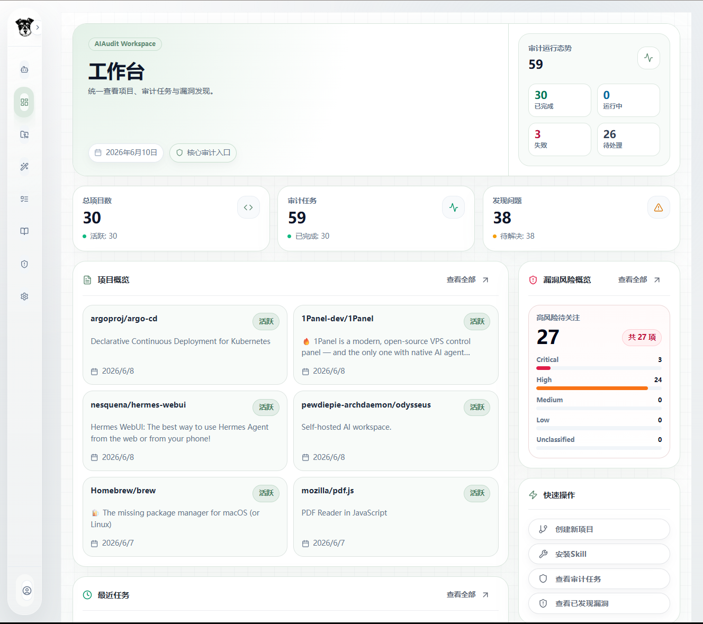

## 目录

- [1. 系统要求](#1-系统要求)
- [2. 快速开始](#2-快速开始)
- [3. 模型配置](#3-模型配置)
- [4. 工作流管理](#4-工作流管理)
- [5. 项目管理](#5-项目管理)
- [6. 审计任务](#6-审计任务)
- [7. 漏洞管理](#7-漏洞管理)
- [8. Skills管理](#8-skills管理)

## 1. 系统要求

AIAudit 是一个前后端分离的 AI 代码安全审计平台，核心服务包括：

- 前端：React + Vite，默认端口 `3000`
- 后端：FastAPI，默认端口 `8000`
- 数据库：PostgreSQL 15
- 缓存/任务状态：Redis 7
- 沙箱镜像：`auditai-sandbox:latest`，用于安全工具执行和 PoC 验证
- 可选管理工具：Adminer，默认端口 `8080`

### 推荐配置

| 资源 | 推荐配置 | 说明 |
| --- | --- | --- |
| CPU | 4 核及以上 | Agent 审计、依赖扫描和仓库克隆会占用 CPU |
| 内存 | 8 GB 及以上 | 小项目 4 GB 可运行，大项目建议 8 GB 起步 |
| 磁盘 | 20 GB 及以上 | 需要保存镜像、数据库、上传 ZIP、项目工作区和审计结果 |
| Docker | Docker 20.10+ | 推荐使用 Docker Compose 部署 |
| Docker Compose | 2.24.0+ | 使用 `docker compose` 命令，支持可选 `env_file` 配置 |
| 网络 | 可访问模型 API 和 GitHub/GitLab/Gitea | 一键 CVE、仓库导入、模型调用依赖外部网络 |

### 本地开发依赖

如果不使用 Docker，而是本地开发运行，需要：

- Node.js 20+
- pnpm 或 npm
- Python 3.11+
- uv
- PostgreSQL 15+
- Redis 7+

### 账号说明

系统初始化时会创建演示账号：

```text
邮箱：demo@example.com
密码：demo123
```

生产环境部署后，请及时修改默认账号密码，或删除演示账号。

## 2. 快速开始

Docker Compose 是最推荐的部署方式，会同时启动前端、后端、数据库、Redis、沙箱镜像和 Adminer。

### 2.1 克隆项目

```bash
git clone <你的仓库地址>
cd AIAudit
```

如果你已经在本地有项目目录，直接进入项目根目录即可。

### 2.2 快速启动

进入项目根目录后直接执行：

```bash
docker compose up -d --build
```

该命令会自动启动前端、后端、数据库、Redis、沙箱镜像和 Adminer。启动完成后，打开 `http://localhost:3000`，使用演示账号登录，再进入「系统设置 > 模型配置」填写模型信息即可。

### 2.3 检查服务状态

启动后检查服务状态：

```bash
docker compose ps
```

常用服务地址：

| 服务 | 地址 | 用途 |
| --- | --- | --- |
| 前端 | http://localhost:3000 | 用户界面 |
| 后端 API | http://localhost:8000 | API 服务 |
| Swagger | http://localhost:8000/docs | API 调试文档 |
| Adminer | http://localhost:8080 | 数据库管理 |

### 2.4 首次登录

打开：

```text
http://localhost:3000
```

使用演示账号登录：

```text
demo@example.com / demo123
```

登录后建议先完成两件事：

1. 进入「系统设置 > 模型配置」，确认模型可用。
2. 进入「项目管理」，导入一个测试项目，创建一次 Agent 审计任务。


## 3. 模型配置

功能入口：

```text
系统设置 > 模型配置
```

界面概览：

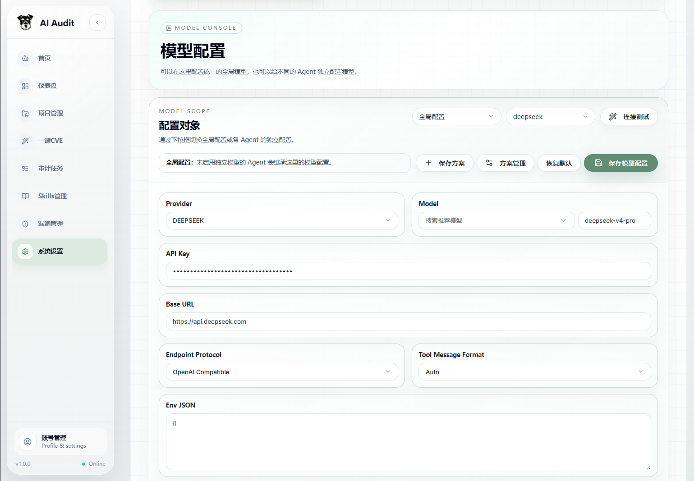

### 3.1 全局模型配置

进入「系统设置 > 模型配置」，首先配置全局模型。全局模型是所有 Agent 的默认模型，当某个 Agent 没有单独启用模型配置时，会回退使用全局配置。

常见字段：

| 字段 | 说明 |
| --- | --- |
| Provider | 模型提供商，例如 `openai`、`gemini`、`claude`、`qwen`、`deepseek`、`zhipu`、`moonshot`、`ollama`、`baidu`、`minimax`、`doubao`。 |
| Model | 模型名称，可以从推荐列表选择，也可以手动输入。 |
| API Key | 模型 API 密钥。 |
| Base URL | 模型产商或中转站Base URL |
| Max Iterations | Agent最大循环轮次 |
| Endpoint Protocol | 模型协议，支持 OpenAI Compatible、Anthropic、Google。 |
| Tool Message Format | 工具消息格式，支持 Auto、Follow Protocol、XML、JSON。 |
| Env JSON | 为模型调用追加环境变量，必须是合法 JSON 对象。 |

配置完成后，可点击「连接测试」确认连通性；确认无误后，点击「保存模型配置」即可。

### 3.2 模型方案

模型方案用于保存一套可复用的模型配置，便于快速切换不同模型配置。

常用操作：

- 保存方案：把当前全局模型配置保存为一个命名方案。
- 设为默认方案：恢复默认时会应用该方案。
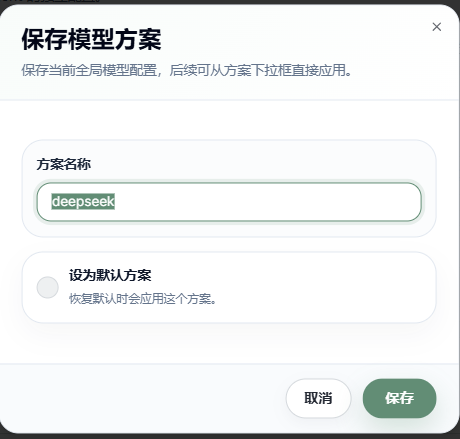
- 应用方案：在顶部下拉框中选择应用的方案并点击「保存模型配置」。
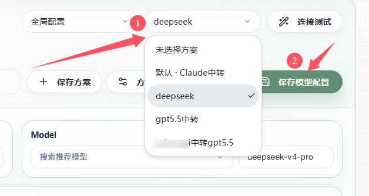
- 方案管理：查看、编辑、删除已有方案。
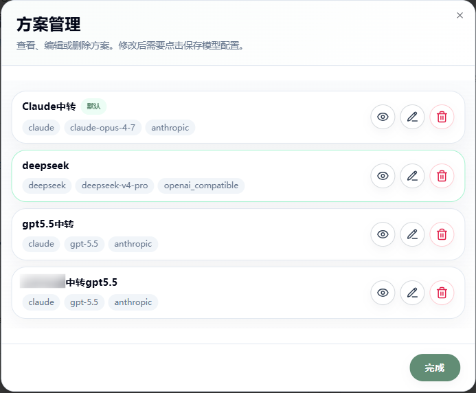

### 3.3 各 Agent 使用不同模型

AIAudit 支持为不同 Agent 单独配置模型。当前可配置的 Agent 包括：

| Agent | 职责 | 模型建议 |
| --- | --- | --- |
| Orchestrator | 编排审计流程和阶段分发 | 稳定、上下文能力较强的模型。 |
| Recon | 信息收集、项目结构梳理、入口发现 | 长上下文、代码理解能力好的模型。 |
| Scan | 调用扫描工具、整理工具输出 | 成本较低、格式稳定的模型。 |
| Triage | 误报过滤 | 判断稳定、能遵循证据的模型。 |
| Finding | 漏洞深挖、攻击链构造、报告生成 | 推理能力强、代码理解强的模型。 |
| Verification | 漏洞动态验证 | 推理能力强、保守可靠的模型。 |
| audit_chat | 用户对话 | 对话体验好、能理解上下文的模型。 |

在「模型配置」中切换配置范围：

```text
Global -> Orchestrator -> Recon -> Scan -> Triage -> Finding -> Verification
```

当某个 Agent 的配置开启后，该 Agent 会优先使用自己的模型参数；未开启时使用全局模型。

每个 Agent 可单独设置：

- Provider
- Model
- API Key
- Base URL
- Endpoint Protocol
- Tool Message Format
- Max Iterations
- Env JSON

### 3.4 中转站协议选择

如果使用中转站，Provider 应按中转站对外暴露的接口协议选择，而不是只按模型名称选择。例如中转站虽然背后接的是 GPT 模型，但如果它对外提供的是 Anthropic/Claude 兼容接口，则 Provider 需要选择 CLAUDE，Model 填写实际模型名，如 gpt-5.x；如果中转站对外提供的是 OpenAI Chat Completions 兼容接口，则 Provider 选择 OPENAI。

两类协议的工具调用格式不同：
OpenAI 使用 function call 消息结构
```http
POST https://host/v1/chat/completions
Authorization: Bearer sk-...

{
  "model": "gpt-5.5",
  "messages": [
    {"role": "system", "content": "..."},
    {"role": "user", "content": "..."}
  ],
  "tools": [
    {
      "type": "function",
      "function": {
        "name": "Read",
        "parameters": {...}
      }
    }
  ]
}
```
Claude/Anthropic 使用 tool_use / tool_result 消息块
```http
POST https://host/v1/messages
x-api-key: sk-...
anthropic-version: xxxx-xx-xx

{
  "model": "claude-opus-4-8",
  "system": "...",
  "messages": [
    {
      "role": "user",
      "content": [{"type": "text", "text": "..."}]
    }
  ],
  "tools": [
    {
      "name": "Read",
      "input_schema": {...}
    }
  ]
}
```
请确保 Provider 与中转站协议一致，否则普通文本对话可能可用，但 Agent 工具调用、审计循环或结果提交可能失败。


## 4. 工作流管理

功能入口：

```text
系统设置 > 工作流管理
```
界面概览：

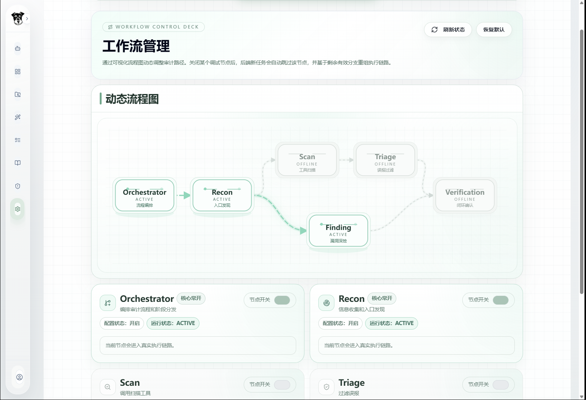

工作流管理用于动态控制新审计任务会执行哪些 Agent 节点。

默认流程：

```text
Orchestrator -> Recon -> Scan -> Triage -> Verification
                      \-> Finding -> Verification
```

节点说明：

| 节点 | 是否核心常开 | 说明 |
| --- | --- | --- |
| Orchestrator | 是 | 负责审计任务编排，不能关闭 |
| Recon | 是 | 负责项目信息收集，不能关闭 |
| Scan | 否 | 调用 Semgrep、Bandit等扫描工具。|
| Triage | 否 | 对扫描结果进行误报过滤 |
| Finding | 否 | 根据项目上下文进行漏洞深挖。|
| Verification | 否 | 漏洞动态验证（不稳定） |

工作流开关规则：

- Orchestrator 和 Recon 始终开启。
- 关闭 Scan 后，Triage 会因为上游缺失而被跳过。
- Verification 只有在 Finding 开启，或 Scan + Triage 有效时才会进入执行链路。
- 配置只影响后续新建任务，不会改变已经运行或已经完成的任务。

使用建议：

- 快速体验：保留默认工作流。
- 只做深度漏洞挖掘：开启 Finding ，可关闭 Scan/Triage。
- 只做工具扫描和误报过滤：开启 Scan/Triage，可关闭 Finding。

## 5. 项目管理

功能入口：

```text
项目管理
```
界面概览：

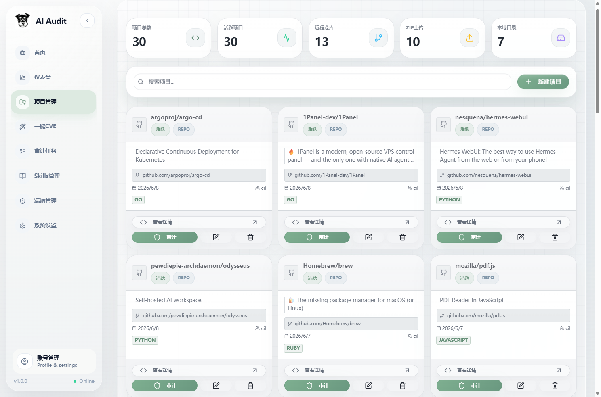

该页面用于创建项目、上传源码、管理分支、编辑项目元数据、删除项目，以及从项目入口直接创建审计任务。

### 5.1 项目创建

当前支持三类项目来源：

| 类型 | 说明 | 适用场景 |
| --- | --- | --- |
| 远程仓库 | 通过 GitHub、GitLab、Gitea 或其他 Git URL 导入 | 审计开源项目 |
| ZIP 上传 | 上传 `.zip` 源码包，系统解压为持久源码目录 | 审计本地代码 |


#### 5.1.1 从Git仓库导入项目

操作步骤：

1. 打开「项目管理」
2. 点击「新建项目」按钮
3. 选择「Git仓库」
4. 填写项目名称
5. 填写项目描述，可选
6. 选择仓库来源：GitHub、GitLab、Gitea 或 Other
7. 填写仓库地址
8. 选择或填写默认分支
9. 选择项目语言标签
10. 点击「执行创建」

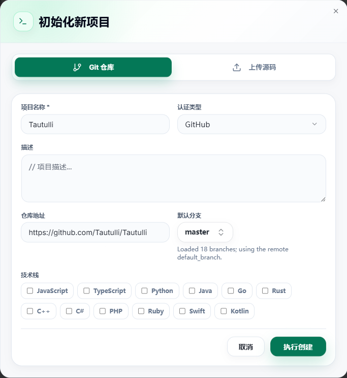

仓库地址建议：

```text
GitHub HTTPS：https://github.com/owner/repo
```

Token 配置建议：

- GitHub 私有仓库需要 `GITHUB_TOKEN` 或用户级 GitHub Token
- GitLab 私有仓库需要 `GITLAB_TOKEN`
- Gitea 私有仓库需要 `GITEA_TOKEN`
- SSH 仓库需要在系统配置中保存 SSH 私钥

Tips：创建项目时，系统会尝试获取远程默认分支和分支列表。如果获取失败，会回退到用户填写的默认分支。

#### 5.1.2 从本地导入项目

操作步骤：

1. 打开「项目管理」
2. 点击「新建项目」按钮
3. 选择「上传源码」
4. 填写项目名称和描述
5. 选择项目语言标签
6. 选择 `.zip` 文件
7. 提交上传
8. 点击「执行创建」

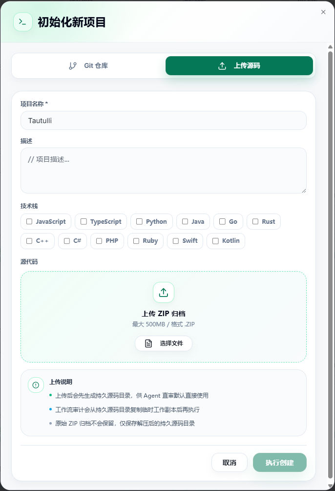

Tips：

- 仅支持 `.zip`
- 单个 ZIP 最大 500 MB
- 上传后会先生成持久源码目录
- 工作流审计会从持久源码目录复制临时工作副本后再执行

### 5.2 项目列表

项目列表支持：

- 搜索项目名称或描述
- 查看项目来源类型
- 查看仓库平台、默认分支、语言标签
- 进入项目详情
- 直接创建审计任务
- 编辑项目
- 删除项目

Tips：删除项目会永久删除项目记录及关联审计数据。请在删除前确认不再需要该项目。

### 5.3 项目详情

项目详情页包括：

- 项目概览：仓库地址、项目类型、平台、默认分支、创建时间、所有者、语言标签
- 最近活动：最近的审计任务
- 审计任务：查看历史任务，进入任务详情
- 问题管理：汇总该项目历史审计中发现的所有漏洞
- 项目设置：编辑项目名称、描述、仓库地址、分支、语言

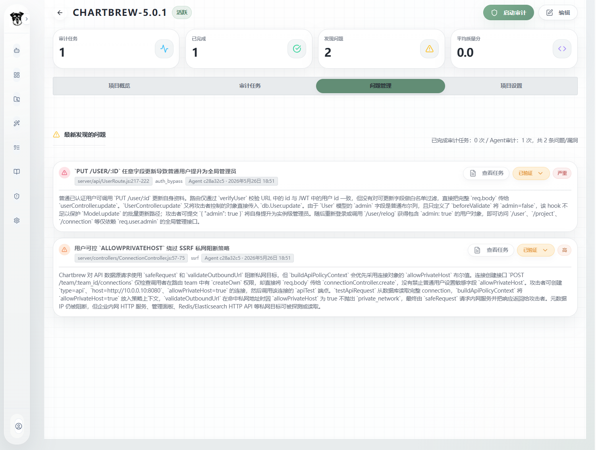

## 6. 审计任务

功能入口：

```text
项目管理
```
界面概览：

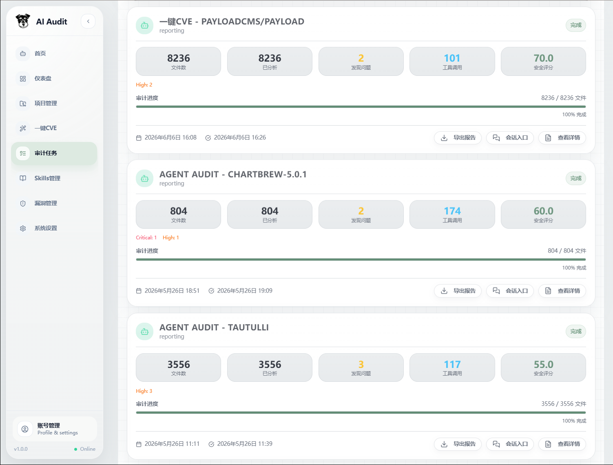

### 6.1 创建 Agent 审计任务

通常使用以下两个入口创建审计任务：

- 项目管理：选中项目后创建审计任务
- 项目详情：点击「启动审计」

操作步骤：

1. 选择项目
2. 输入项目版本号
3. 选择审计模式
4. 选择是否开启动态验证
5. 打开高级选项，按需选择扫描范围
6. 按需配置排除规则
7. 开始审计

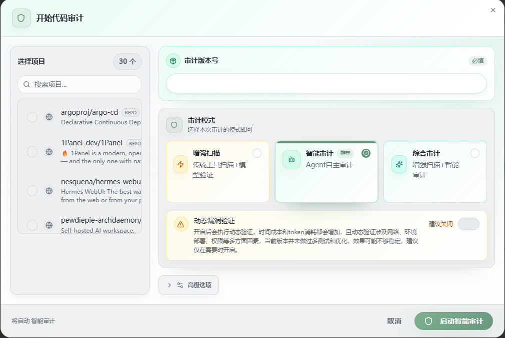

当前支持三种审计模式：

| 模式 | 说明 | 核心Agent | 适用场景 |
| --- | --- | --- | --- |
| 增强扫描 | 传统工具扫描+模型验证 | Scan → Triage | 对工具扫描结果进行快速分析 |
| 智能审计 | Agent自主审计 | Finding | 快速产出高质量漏洞，适合CVE、0Day挖掘 |
| 综合审计 | 增强扫描+智能审计 | Scan → Triage + Finding | 对项目进行全量审计 |

### 6.2 审计运行页面

审计任务创建后会进入：

```text
/agent-audit/{taskId}
```

页面主要由三部分组成：

- 左侧活动日志：显示实时 Agent 活动、思考、工具调用、结果输出
- 右侧 Agent Tree：显示当前参与审计的 Agent、层级关系和运行状态
- 统计面板：显示文件数、工具调用次数、漏洞数量、严重等级分布等

活动日志会通过 SSE 实时更新。如果连接中断，页面会尝试加载历史事件并恢复显示。

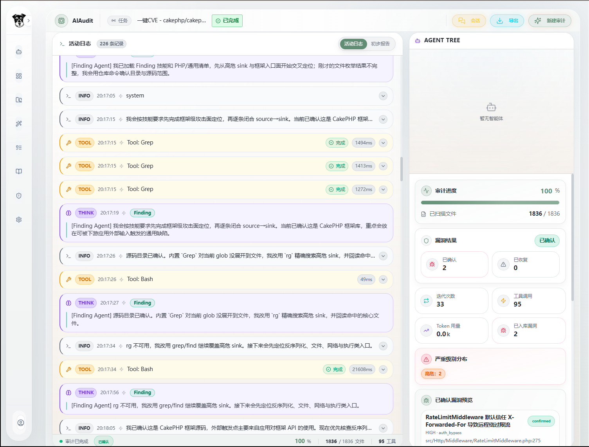

#### 6.2.1 活动日志

活动日志会展示：

- Agent 思考过程
- 工具调用输入
- 工具调用输出
- 阶段切换
- 最终结果

日志类型包括：

- `thinking`：模型推理和决策过程
- `tool`：工具调用
- `info`：普通状态信息
- `error`：错误信息
- `dispatch`：Agent 交接
- `user`：用户输入

#### 6.2.2 初步报告

任务完成后，页面会出现「活动日志 / 初步报告」切换。

初步报告会展示：

- 漏洞标题
- 风险等级
- 漏洞类型
- 置信度
- 文件路径与行号
- 漏洞描述
- Source / Sink
- 影响说明
- 利用链
- PoC 信息
- 验证说明

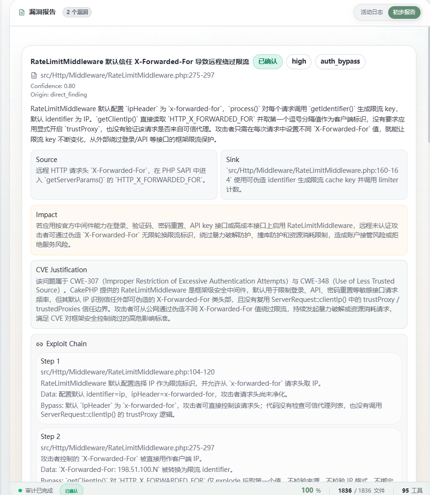

初步报告仅作展示，更详细的报告会在漏洞管理处同步。

### 6.3 用户对话

Finding Agent审计过程会同步至运行时会话，功能入口：

```text
/audit-sessions/{sessionId}
```
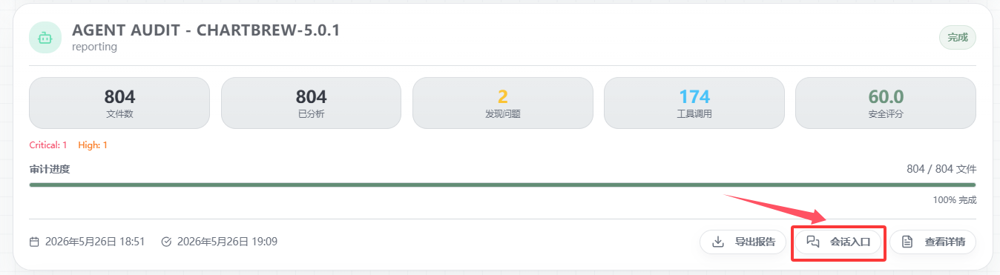

用户会话功能会将审计全过程作为会话上下文，用户可以在审计完成之后继续追问。

页面组成：

- 主时间线：展示用户消息、模型回复、工具调用结果
- 右侧审计记录：展示 Trace、Agent 交接、工具调用、Skill 使用和记忆记录
- Follow-up 输入框：继续向审计会话提问

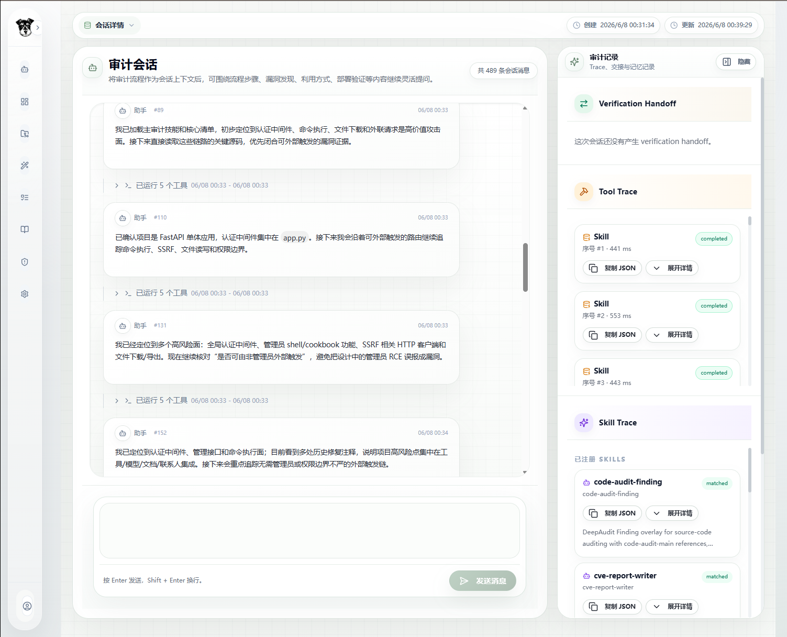

可以展开查看工具调用详情

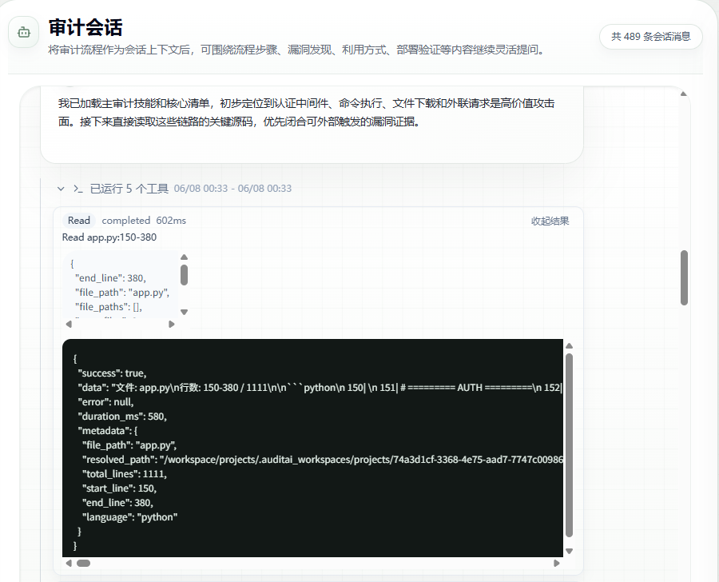

可以输入 $ 显示调用Skill（如果未指定模型会根据任务自动匹配适合的Skill）

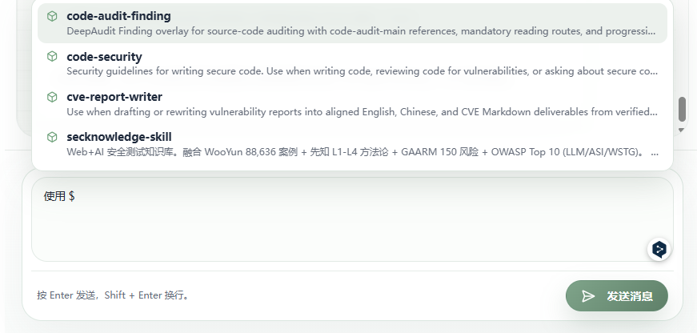

可以以审计过程作为上下文进行任意对话，比如要求Agent对审计流程进行提问、对漏洞内容进行补充、对部署利用进行详细说明等等。


### 6.4 取消任务

运行中的 Agent 审计任务支持取消。点击审计页中的取消按钮后，后端会标记任务取消，正在运行的执行循环会在安全检查点停止。

取消后：

- 已保存的事件仍可查看
- 已产生的 Finding 仍会保留
- 未完成的阶段不会继续执行

## 7. 漏洞管理

功能入口：

```text
漏洞管理
```
界面概览：

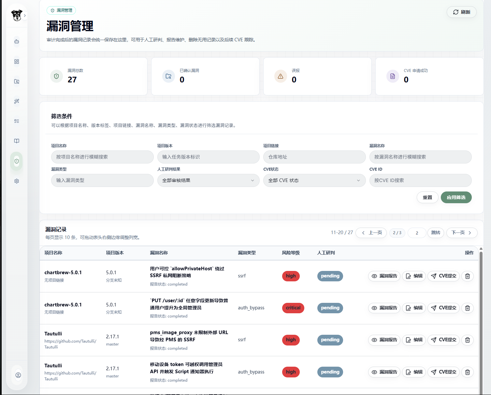

审计完成后的漏洞会统一保存到这里，方便做人工研判、报告维护、CVE 申请跟踪和结果导出等操作。

### 7.1 漏洞筛选

支持按以下字段筛选：

| 字段 | 用途 |
| --- | --- |
| 项目名称 | 按项目名称进行模糊搜索 |
| 项目版本 | 按版本版本搜索 |
| 项目链接 | 按仓库 URL 搜索 |
| 漏洞名称 | 按漏洞标题进行模糊搜索 |
| 漏洞类型 | 例如 SSRF、SQL Injection、XSS、RCE |
| 人工研判结果 | 待确认、已确认、误报 |
| CVE 状态 | 未申请、申请中、申请成功、申请失败 |
| CVE ID | 按 CVE 编号搜索 |


### 7.2 查看漏洞报告

点击「漏洞报告」后，会打开漏洞报告弹窗。报告包含三个标签：

- 中文报告
- English Report
- CVE 报告

报告支持：

- 预览
- Markdown 编辑
- 实时预览
- 保存修改
- 重置为原始内容
- 复制 Markdown
- 导出 Markdown

报告内容通常包含：

- Summary
- Details
- POC
- Impact
（上述四项可直接复制用于从Github Advisory提交漏洞报告，如下所示）
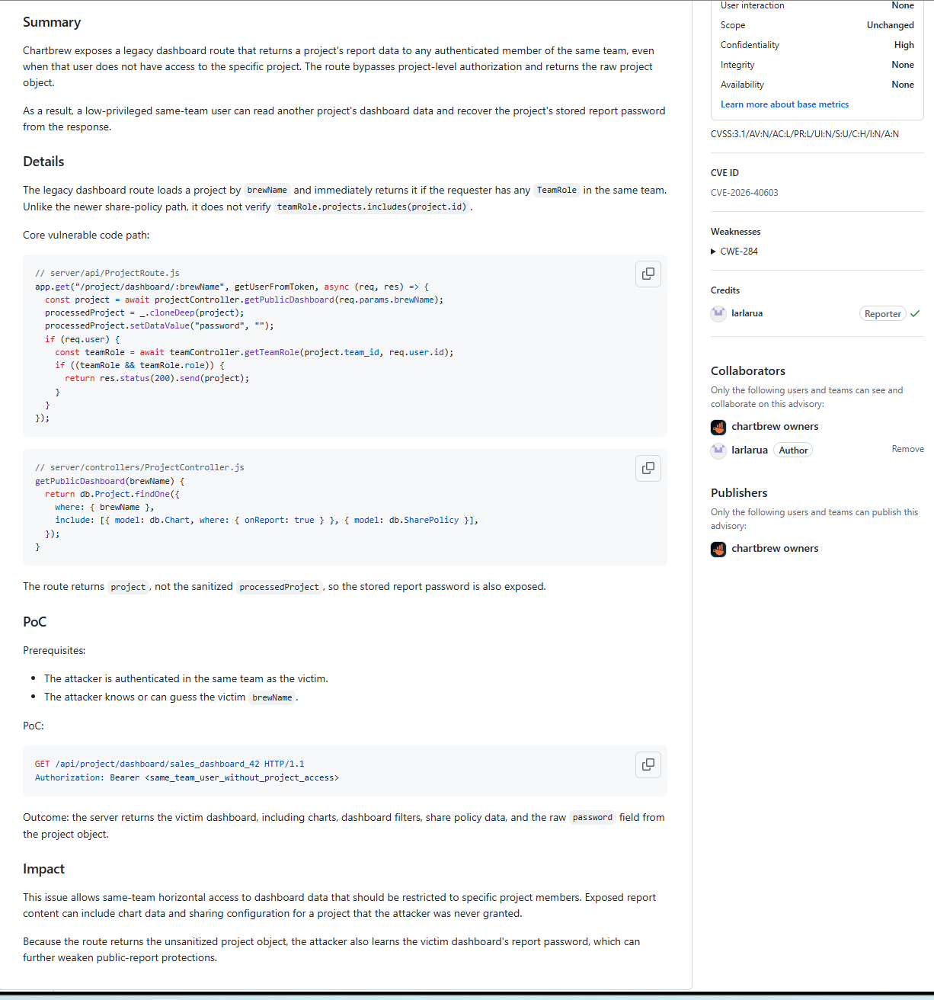
- Remediation
- Disclosure Notes
- Affected products
- CVSS
- CWE
- Suggested description of the vulnerability for use in the CVE

报告示例：

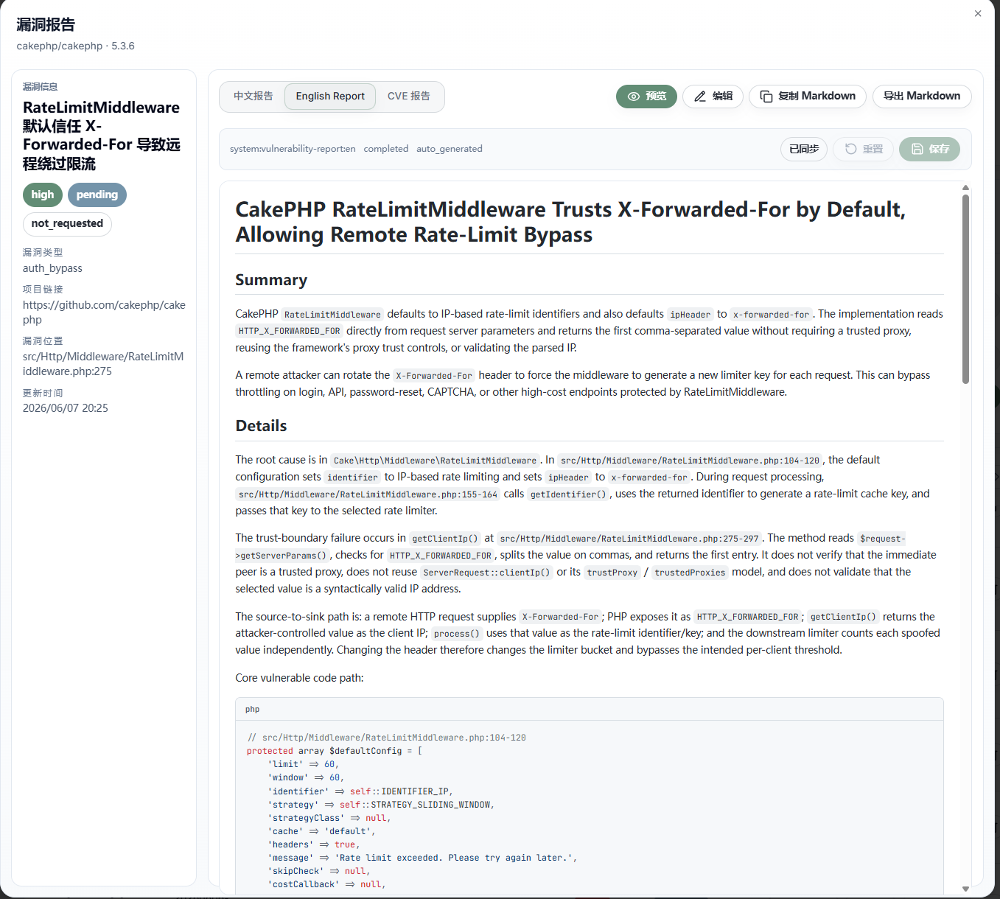

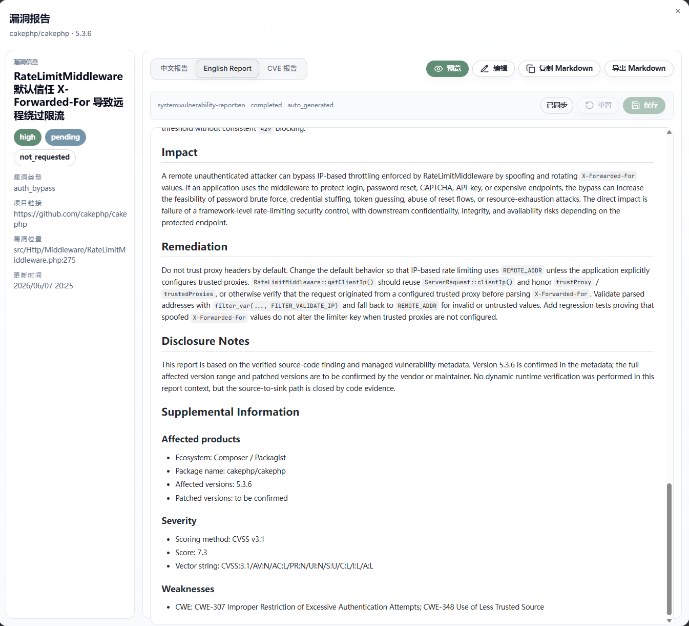

### 7.3 编辑漏洞记录

点击编辑后，可以修改：

- 漏洞名称
- 漏洞类型
- 风险等级
- 人工研判结果
- CVE 申请状态
- CVE ID
- CVE 失败原因

人工研判建议：

- 确认可复现或证据链完整后，设为「已确认」
- 明确不是漏洞或缺少可利用路径时，设为「误报」
- 还未看完证据时，保留「待确认」

CVE 状态建议：

- 未提交前：未申请
- 已向维护者或 CNA 提交：申请中
- 已获得 CVE ID：申请成功，并填写 CVE ID
- 被拒绝或证据不足：申请失败，并填写失败原因

## 8. Skills管理

功能入口：

```text
Skills管理
```
界面概览：

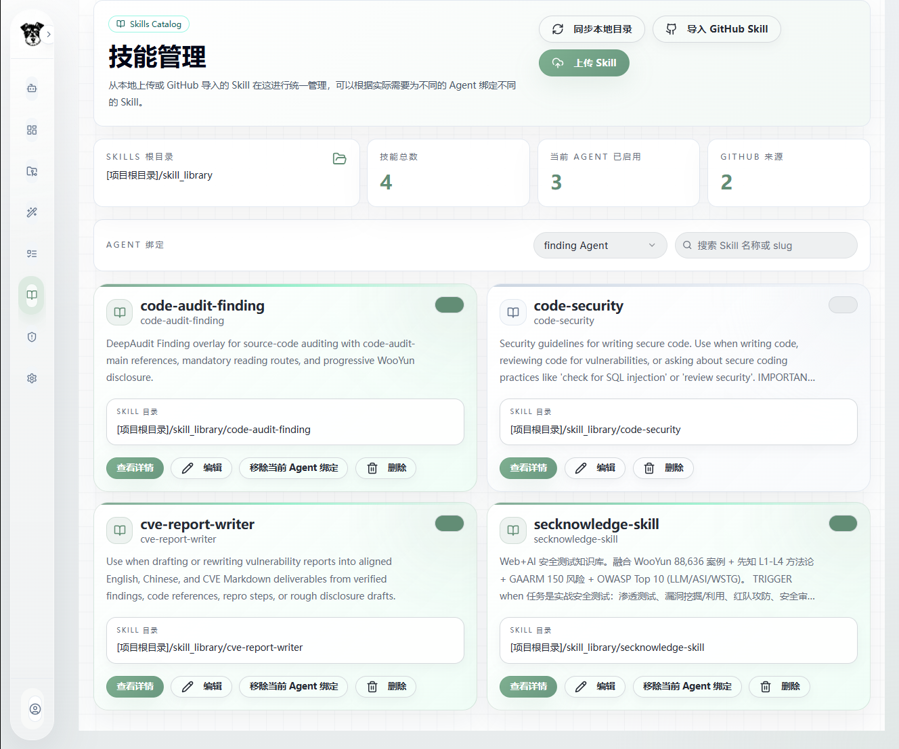

### 8.1 Skill 作用

Skill 可以让 Agent 在特定任务中拥有更专业的知识和流程，例如：

- Java 反序列化审计
- PHP 文件上传漏洞审计
- SSRF 检测方法
- CVE 报告撰写
- huntr 提交流程
- 企业内部安全规范

系统会根据 Agent 类型、绑定关系和任务上下文解析可用 Skills。

### 8.2 Skill 根目录

页面顶部会显示 Skill 根目录，通常为：

```text
[项目根目录]/skill_library
```

Docker 部署中，对应挂载：

```text
./skill_library:/app/skill_library
```

你也可以直接把 Skill 文件夹放到 `skill_library/` 下，然后点击「同步本地目录」。

### 8.3 Agent 绑定 Skill

页面支持选择 Agent：

- orchestrator Agent
- recon Agent
- scan Agent
- triage Agent
- finding Agent
- verification Agent
- 用户会话

每个 Skill 卡片右侧有开关，用于启用或停用该 Skill 对当前 Agent 的绑定。

绑定建议：

| Agent | 推荐绑定类型 |
| --- | --- |
| Recon | 项目结构识别、框架识别、攻击面梳理类 Skill |
| Scan | 工具使用、安全扫描、规则解释类 Skill |
| Triage | 误报过滤、证据判断、漏洞分类类 Skill |
| Finding | 漏洞专项、CVE 挖掘方法类 Skill |
| Verification | PoC 验证、沙箱验证、复现判断类 Skill |
| 用户会话 | 根据用户实际使用场景自行添加适合自身使用习惯的Skill |

### 8.4 编辑 Skill 元数据

点击「编辑」可以修改：

- 名称
- Slug
- 描述
- 来源类型
- 来源 URL

注意：这里主要编辑元数据，不适合直接长篇编辑 `SKILL.md`。如果需要大幅修改 Skill 正文，建议直接编辑 `skill_library/<skill>/SKILL.md` 后同步。

### 8.5 导入 GitHub Skill

点击「导入 GitHub Skill」，填写 GitHub 仓库 URL。
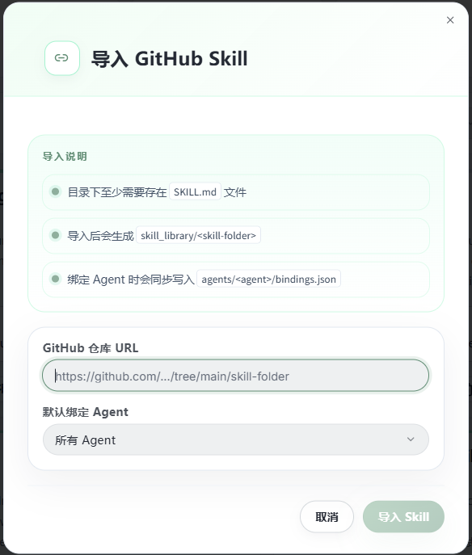


要求：

- 目标目录下至少存在 `SKILL.md`
- 导入后会生成 `skill_library/<skill-folder>`
- 绑定 Agent 时会同步写入 `agents/<agent>/bindings.json`

可以选择：

- 绑定到所有 Agent
- 只绑定到某个 Agent

导入完成后，系统会同步本地技能库

### 8.6 上传 Skill ZIP

点击「上传 Skill」后选择 ZIP 文件。
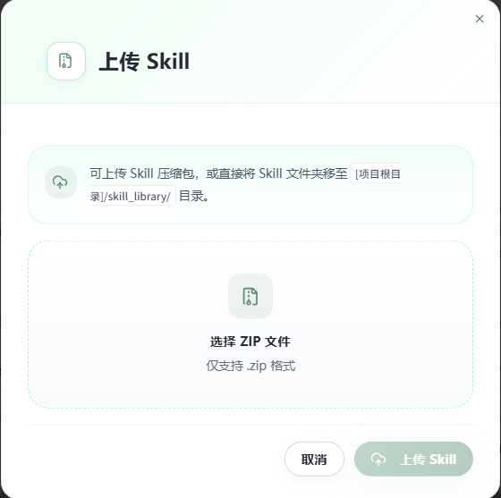

ZIP 包要求：

- 必须包含 `SKILL.md`
- 建议一个 ZIP 对应一个 Skill 文件夹
- 可包含 `references/`、`scripts/`、`assets/` 等扩展目录

上传完成后，刷新 Skills 页面确认导入成功。

### 8.7 删除 Skill

删除 Skill 会删除：

- Skill 文件夹
- `SKILL.md`
- 扩展资源
- 所有 Agent 绑定记录

该操作页面内不可撤销，删除前请确认已经备份
